# 热力学门控网络：注意力作为几何抗耗散力 (Thermodynamic Gated Networks (TGN): Attention as a Geometric Anti-Dissipative Force)

**作者：** 徐明阳 
**机构：** 北京大学
**日期：** 2026年1月21日

---

## 摘要 (Abstract)

复杂系统（如生物神经网络与人工高维模型）如何在热力学熵增条件下维持宏观有序，是物理学与神经科学面临的根本挑战之一。传统的局部相互作用模型（如朗之万动力学）在高维非凸能景中面临指数级的松弛时间，即“玻璃态动力学”问题。在此，我们提出生物神经网络与人工系统中涌现的长程相互作用（Attention）并非工程上的偶然，而是一种对抗高维热力学耗散的几何机制。通过建立基于黎曼几何流的统一理论框架，我们论证了注意力机制在物理上等效于流形上的非局部热核算子（Non-local Heat Kernel），它通过引入**非局部拓扑捷径 (Non-local Topological Shortcuts)**，显著增大了系统的谱间隙并降低了混合时间。理论推导进一步表明，Transformer 中的缩放因子 $1/\sqrt{d}$ 有助于将系统维持在有序与混沌边缘（Edge of Chaos）的临界点。这一理论框架得到了跨领域证据的支持：(1) 在物理仿真中，基于该机制的动力学在大尺度自旋玻璃模型上展现了优于传统热力学退火的标度特性；(2) 在人工智能中，它成功解释并逆转了深层大语言模型的秩坍缩（Rank Collapse）；(3) 在神经科学中，fMRI 分析显示意识状态的维持与长程几何关联的强度存在显著相关性。最终，我们提出了一种热力学门控网络（TGN），表明智能可被视为一种对抗热力学耗散的几何过程，其物理本质遵循某种尺度不变的重整化群流。

---

## 1. 引言 (Introduction)

复杂系统——无论是生物神经网络还是人工深度模型——面临的一个根本物理挑战，是如何在高维、非凸的状态空间中维持低熵的有序状态。根据非平衡统计物理学原理，局部相互作用系统（如过阻尼朗之万动力学）在处理高维能景（Energy Landscape）时面临严峻的比例缩放限制：随着系统自由度 $N$ 的增加，局部亚稳态（Metastable States）的数量呈指数级增长，导致系统的松弛时间发散，陷入所谓的“玻璃态动力学（Glassy Dynamics）”或模式坍缩。

然而，现代人工智能（特别是 Transformer 架构）和生物大脑表现出了超越这一热力学限制的能力，能够在大尺度上维持长程关联。本文提出，这种能力源于一种特定的几何机制。虽然注意力机制（Attention Mechanism）通常被视为一种高效的信息检索工程模块，但我们论证其在数学上同构于黎曼流形上的**非局部热核算子（Non-local Heat Kernel Operator）**。

这种数学同构性揭示了 Attention 的物理本质：它并非仅仅聚合信息，而是作为一种**对抗耗散的几何力（Geometric Anti-dissipative Force）**。通过引入基于内容的非局部耦合，Attention 有效地重构了状态空间的拓扑结构，引入了谱几何中的“捷径（Shortcuts）”。这显著增大了系统的谱间隙（Spectral Gap），使得信息流能够通过非局部路径规避局部梯度的亚稳态陷阱，实现相空间中的快速混合（Fast Mixing）。

在此框架下，我们建立了一个统一的理论模型，阐明了智能系统如何利用非局部几何流来对抗信息流形的热力学耗散（即秩坍缩）。为了验证这一理论的普适性，我们进行了跨越三个物理层级的实证研究：

1.  **统计物理系统**：在 3D 自旋玻璃模型中，我们量化了该几何机制相对于传统热力学退火（如 Parallel Tempering）在算法效率上的标度优势，证明了其在非凸优化中的“几何隧穿（Geometric Tunneling）”效应。
2.  **人工神经网络**：通过监测大型语言模型（LLMs）内部表征流形的微观演化，我们证实 Attention 机制在深层网络中逆转了信息熵的自然衰减，实现了一种特征值的重整化（Rank Renormalization）。
3.  **生物神经系统**：利用人脑 fMRI 数据，我们发现在意识状态的变化过程中，大脑功能网络的几何复杂度展现出与理论预测一致的相变行为，表明生物智能可能遵循同样的拓扑动力学原理。

综上所述，本文提出了**热力学门控网络（Thermodynamic Gated Networks, TGN）**框架。该框架不依赖于特定的生物或工程启发，而是从第一性原理出发，论证了非局部几何连接是高维智能系统克服热力学耗散、维持临界有序状态的物理必然。

---

## 2. 理论框架：基于能量的黎曼几何流 (Theoretical Framework: Energy-Based Riemannian Geometric Flow)

为了从第一性原理阐明 TGN 的物理机制，我们摒弃单纯的生物学类比，转而采用**基于能量的模型 (Energy-Based Models, EBM)** 框架。我们将智能系统的推理过程形式化为状态空间流形 $\mathcal{M}$ 上的梯度流演化。

### 2.1 变分原理：Attention 作为自由能最小化 (Variational Principle: Attention as Free Energy Minimization)

考虑在流形 $\mathcal{M}$ 上，给定查询状态 $\mathbf{q}_i$，我们需要寻找一个最优的概率分布 $\mathbf{a}_i$（即 Attention 权重），以聚合邻域信息 $\mathbf{K}$。这一过程受两个对抗性约束控制：
1.  **几何亲和性 (Geometric Affinity)**：系统倾向于利用切空间中与 $\mathbf{q}_i$ 方向一致的特征 $\mathbf{k}_j$。我们定义局部势能为内积的负值：$E_{ij} = -\langle \mathbf{q}_i, \mathbf{k}_j \rangle$。
2.  **最大熵原理 (Maximum Entropy)**：为防止过拟合（即落入狄拉克分布 $\delta$ 的平凡解），系统必须维持分布的多样性。

根据统计物理学的**最大熵原理**，这一问题等价于求解以下约束优化问题：

$$
\min_{\mathbf{a}_i} \mathcal{F}[\mathbf{a}_i] = \underbrace{\sum_{j} a_{ij} E_{ij}}_{\text{Internal Energy } \mathcal{U}} - \tau \underbrace{\left( -\sum_{j} a_{ij} \log a_{ij} \right)}_{\text{Shannon Entropy } \mathcal{S}}
$$

$$
\text{s.t.} \quad \sum_{j} a_{ij} = 1, \quad a_{ij} \ge 0
$$

其中 $\tau$ 是拉格朗日乘子，对应于系统的**计算温度**。

**推导 2.1**：
构建拉格朗日函数 $\mathcal{L} = \sum a_{ij} E_{ij} + \tau \sum a_{ij} \log a_{ij} + \lambda (\sum a_{ij} - 1)$。令 $\frac{\partial \mathcal{L}}{\partial a_{ij}} = 0$，我们得到：
$$
E_{ij} + \tau (1 + \log a_{ij}) + \lambda = 0 \implies \log a_{ij} = -\frac{E_{ij}}{\tau} - \left(1 + \frac{\lambda}{\tau}\right)
$$
解得最优分布为 Boltzmann 分布形式：
$$
a_{ij}^* = \frac{\exp(-E_{ij}/\tau)}{\sum_k \exp(-E_{ik}/\tau)} = \text{Softmax}\left( \frac{\langle \mathbf{q}_i, \mathbf{k}_j \rangle}{\tau} \right)
$$

**物理推论**：
Transformer 中的 Softmax Attention 并非工程经验设计，而是**亥姆霍兹自由能 (Helmholtz Free Energy)** $\mathcal{F} = \mathcal{U} - \tau \mathcal{S}$ 在单纯形上的唯一极小值解。其中缩放因子 $1/\sqrt{d}$ 确切地扮演了逆温度 $\beta = 1/\tau$ 的角色。

### 2.2 动力学方程：逆契约几何流 (Dynamics: Inverse Contractive Geometric Flow)

在深度网络中，非线性激活函数（如 ReLU/Tanh）通常具有**压缩性 (Contractive)**，导致流形体积收缩（即秩坍缩，Rank Collapse）。我们将 Attention 机制形式化为一种**逆契约流**，用于对抗这种自然的维度衰减。

我们将残差更新 $\mathbf{h}_{t+1} = \mathbf{h}_t + \text{Attn}(\mathbf{h}_t)$ 视为连续时间微分方程的离散化：

$$
\frac{d\mathbf{h}}{dt} = -\nabla_{\mathbf{h}} \mathcal{V}_{local}(\mathbf{h}) - \nabla_{\mathbf{h}} \mathcal{F}_{global}(\mathbf{h})
$$

*   第一项 $-\nabla \mathcal{V}_{local}$ 对应于 FFN/RNN 的局部处理，通常导致信息流形向低维吸引子坍缩（耗散）。
*   第二项 $-\nabla \mathcal{F}_{global}$ 是由 Attention 引入的非局部梯度流。

**数学性质**：
当温度 $\tau = 1/\sqrt{d}$ 处于临界区时，Attention 矩阵 $\mathbf{A}$ 近似于流形上的**热核算子 (Heat Kernel)** $e^{-t\Delta}$。根据谱几何理论，热核算子具有**平滑**与**扩散**的双重性质。在特征值谱上，它能够提升微小的特征值（对应长程模式），从而在数学上逆转协方差矩阵的条件数恶化。

这就是我们在文中称之为“抗耗散力”的严格数学定义：**Attention 是一个作用于切丛上的谱正则化算子 (Spectral Regularization Operator)，它通过注入非局部相关性来维持流形的有效维度。**

### 2.3 临界温度与测度集中 (Critical Temperature & Concentration of Measure)

我们需要考察 $\tau$ 的物理意义。假设 $\mathbf{q}, \mathbf{k} \in \mathbb{R}^d$ 为独立随机向量，分量服从 $\mathcal{N}(0, 1)$。其点积 $X = \mathbf{q}^T \mathbf{k}$ 的方差为 $d$。当 $d \gg 1$ 时，根据**测度集中 (Concentration of Measure)** 现象，未缩放的点积值域将集中在 $O(\sqrt{d})$ 范围。

如果 $\tau$ 设定不当，将导致系统偏离动力学的**“混沌边缘” (Edge of Chaos)**：

1.  **冷冻极限 ($\tau \ll \sqrt{d}$)**：Softmax 梯度消失，Attention 退化为 One-hot。物理上对应于流形离散化，梯度传播受阻。
2.  **熔化极限 ($\tau \gg \sqrt{d}$)**：Attention 退化为均匀分布（Mean Field）。流形拓扑被噪声淹没。
3.  **临界态 ($\tau \approx \sqrt{d}$)**：此时 Attention 既非狄拉克分布也非均匀分布，系统处于**最大几何熵**状态，允许梯度在深层网络中有效传播。

这为 Transformer 的缩放因子 $1/\sqrt{d}$ 提供了一个基于平均场理论 (Mean Field Theory) 的严格解释：它是为了对抗高维空间的测度集中，保持系统处于**等距同构 (Isometry)** 附近的必要条件。

### 2.4 线性稳定性分析：K=1 的奇点 (Linear Stability Analysis: The Singularity of K=1)

为了从数学上严格解释仿真中观察到的 "$K=1$ 不稳定性" 现象，我们对分布式迭代过程进行线性稳定性分析。这一现象在经典控制理论中并不陌生，类似于反馈增益过大导致的**过冲 (Overshoot)**。然而，在我们的分布式网络语境下，它对应着一种特定的**拓扑障碍**。

考虑系统在不动点 $\mathbf{x}^*$ 附近的误差动力学 $\mathbf{e}_t = \mathbf{x}_t - \mathbf{x}^*$。离散时间的迭代更新可以表示为：

$$
\mathbf{e}_{t+1} = (\mathbf{I} - \alpha \hat{\mathbf{G}}_K) \mathbf{e}_t
$$

其中 $\hat{\mathbf{G}}_K$ 是基于 $K$ 步协商所估计的有效几何算子（度量张量）。系统的稳定性完全取决于迭代矩阵 $\mathbf{M} = \mathbf{I} - \alpha \hat{\mathbf{G}}_K$ 的谱半径 $\rho(\mathbf{M})$。稳定性条件要求所有的特征值 $\mu_i$ 满足 $|\mu_i| < 1$。

1.  **一阶盲视 ($K=1$)**：
    此时智能体仅利用局部梯度，等效于 $\hat{\mathbf{G}}_1 \approx \mathbf{I}$（单位阵假设）。此时实际的物理 Hessian $\mathbf{H}$ 被错误地估计为常数。
    **不稳定性来源**：当 $\alpha$ 保持常数时，对于高频模态（High-frequency modes），极易出现 $|1 - \alpha \lambda_{max}| > 1$。这意味着误差不仅不衰减，反而在迭代中交替变号并指数级放大。这就是我们在图 3 中观察到的“过冲”与能量发散。

    我们必须指出，这里的线性稳定性分析提供了一个局部近似。在真实的非线性损失地貌中，这种不稳定性表现为陷入鞍点或高损耗区域，而非简单的数值溢出。

2.  **二阶阻尼 ($K \ge 2$)**：
    当引入 $K=2$ 时，智能体通过邻居的反馈感知到了 $\nabla V$ 的空间变化率，即有效地逼近了 $\hat{\mathbf{G}}_2 \approx \mathbf{H}_{diag}$ 或更复杂的拉普拉斯近似。
    物理上，这引入了一个**几何阻尼项 (Geometric Damper)**。迭代矩阵变为 $\mathbf{M} \approx \mathbf{I} - \alpha \mathbf{H}^{-1} \mathbf{H} \approx 0$。
    通过重整化算子，刚性模态的巨大曲率 $\lambda_{max}$ 被其自身的逆算子抵消，使得所有模式的有效特征值都被“拉回”到单位圆内 ($\rho \ll 1$)。

因此，$K=1$ 到 $K=2$ 的转变，并非精度的量变，而是从**“谱半径发散区”**到**“谱半径收敛区”**的拓扑相变。

### 2.5 拓扑必要性证明：Arrhenius 壁垒的对数化 (Topological Necessity: Logarithmization of Arrhenius Barriers)

为了证明 Attention 并非一种随意的工程选择，而是解决玻璃态动力学的**关键拓扑解**，我们考察 Kramers 逃逸速率。对于任何仅具有局部连接（$K \ll \log N$）的系统，其跨越能垒 $\Delta E$ 的平均时间 $\tau$ 遵循 Arrhenius 定律：

$$
\tau_{local} \propto \exp\left( \frac{\Delta E}{k_B T_{sys}} \right)
$$

在非凸优化问题（如自旋玻璃或深度学习）中，典型能垒高度 $\Delta E$ 通常随系统自由度数目 $N$ 呈幂律增长（$\Delta E \sim N^\alpha, \alpha > 0$）。这意味着局部系统的松弛时间 $\tau_{local}$ 将随 $N$ 呈指数级发散。这就是物理上的“玻璃态冻结”或计算上的“维度障碍”。

Attention 机制通过基于内容的非局部耦合，实际上引入了一个形变的度量张量 $\mathbf{G}_{Attn}$。从**谱图理论 (Spectral Graph Theory)** 的角度来看，Attention 矩阵相当于向原始的稀疏邻接矩阵中添加了低秩扰动，极大地增加了图的**代数连通度 (Algebraic Connectivity)**（即拉普拉斯矩阵的第二小特征值 $\lambda_2$）。

在这个重整化的度量下，原本欧氏距离为 $L$ 的两点，其**有效电阻距离 (Effective Resistance Distance)** 被压缩为 $\text{dist}_{eff} \approx \log L$（小世界特性）。这种谱间隙的扩大直接导致了混合时间 (Mixing Time) 的指数级加速。根据大偏差理论 (Large Deviation Theory) 的路径积分表述，有效能垒高度被重整化为：

$$
\Delta E_{eff} \approx \frac{\Delta E}{\xi_{Attn}} \approx \frac{\Delta E}{\log N}
$$

这一重整化导致系统的弛豫时间发生质的飞跃：

$$
\tau_{Attn} \propto \exp\left( \frac{\Delta E_{eff}}{k_B T_{sys}} \right) = \exp\left( \frac{\Delta E}{k_B T_{sys} \cdot \log N} \right) = N^{\frac{\Delta E}{k_B T_{sys} (\ln N)^2}} \approx \text{Polynomial}(N)
$$

**结论：** Attention 机制提供了一种将原本指数级的**热力学时间 (Arrhenius Time)** 转化为在有效尺度内可控的**计算时间 (Computational Time)** 的可能性。

### 2.6 稀疏性的变分推导：信息瓶颈视角 (Variational Derivation of Sparsity: An Information Bottleneck Perspective)

实验中观察到的 TGN 自发稀疏化现象（~10% Gate Rate），可以被严格描述为**信息瓶颈 (Information Bottleneck, IB)** 问题的最优解。

定义 TGN 的门控决策为二进制随机变量 $g_t \in \{0, 1\}$。系统的目标是在最小化预测误差（Distortion）的同时，最小化通过几何通道的信息流（Rate/Complexity）。总拉格朗日量 $\mathcal{L}$ 定义为：

$$
\mathcal{L}(g_t) = \mathbb{E} \left[ \underbrace{(1-g_t) \ell_{inert} + g_t \ell_{geo}}_{\text{Prediction Loss}} + \underbrace{\lambda \cdot g_t}_{\text{Complexity Cost}} \right]
$$

其中：
*   $\ell_{inert} = -\log p(\mathbf{y} | \mathbf{h}_{rnn})$ 是惯性通道的负对数似然。
*   $\ell_{geo} = -\log p(\mathbf{y} | \mathbf{h}_{rnn}, \mathbf{h}_{attn})$ 是几何通道的负对数似然。
*   $\lambda$ 是稀疏性惩罚系数（对应于热力学中的化学势）。

我们考察门控 $g_t$ 的最优解。对 $\mathcal{L}$ 关于 $g_t$ 求变分（或简单求导）：

$$
\frac{\partial \mathcal{L}}{\partial g_t} = (\ell_{geo} - \ell_{inert}) + \lambda
$$

令导数为 0（或考察边界条件），最优门控策略 $g_t^*$ 遵循**海维赛德阶跃函数 (Heaviside Step Function)** 形式：

$$
g_t^* = \mathbb{I}\left( \underbrace{\ell_{inert} - \ell_{geo}}_{\text{Information Gain } \Delta \mathcal{I}} > \lambda \right)
$$

**物理诠释 (Physical Interpretation)**：
该公式表明，TGN 的门控机制在物理上执行了一个严格的**麦克斯韦妖 (Maxwell's Demon)** 操作：
1.  **测量**：系统测量开启 Attention 带来的瞬时信息增益 $\Delta \mathcal{I}$（即惊奇度的减少量）。
2.  **决策**：仅当 $\Delta \mathcal{I}$ 超过热力学阈值 $\lambda$ 时，门控打开。

由于自然语言和物理过程遵循 **Zipf 定律**，高惊奇度的事件在时间轴上是稀疏分布的（长尾分布）。因此，$P(\Delta \mathcal{I} > \lambda)$ 必然是一个小概率事件。

**结论**：TGN 的稀疏性不是一种人为的算法选择，而是**重尾分布信号 (Heavy-tailed Signal)** 在**率失真约束 (Rate-Distortion Constraint)** 下的解析解。这一推导将“稀疏率”从一个工程超参数提升为数据内在维度的度量。

### 2.7 热力学公式的架构具象化 (Architectural Reification of Thermodynamic Formula)

我们将亥姆霍兹自由能公式 $\mathcal{F} = U - TS$ 视为 TGN 架构设计的物理蓝图。以下是物理量与神经网络组件的严格映射关系：

1.  **内能项 ($U \leftrightarrow \mathcal{L}_{pred}$)**：
    *   *物理意义*：系统的势能，对应于预测误差带来的惊奇度。
    *   *架构对应*：混合预测头。惯性通道 (RNN) 提供基准预测（低势能状态），几何通道 (Attention) 提供修正预测。最小化内能驱动系统追求高精度。

2.  **熵项 ($S \leftrightarrow -\|g\|_1$)**：
    *   *物理辨析*：在经典热力学中，自然界趋向于熵最大化 ($\min \mathcal{F} = U - TS$)。然而，在生命与智能系统中，为了维持低熵的有序结构（薛定谔的负熵），系统必须做功以对抗自然耗散。因此，在 TGN 的变分自由能框架（Friston's Free Energy Principle）中，该项对应于**变分复杂度 (Variational Complexity)** 或**负熵 (Negentropy)**。
    *   *架构对应*：我们通过最小化 $\lambda \|g\|_1$ 来压制系统的微观自由度（门控熵），这在物理上等价于引入一股**负熵流**来抵消计算过程中的热力学熵产。Gate 全开 ($g=1$) 对应高能耗的高自由度状态；Gate 全关 ($g=0$) 对应低能耗的冷寂状态。

3.  **温度项 ($T \leftrightarrow \lambda$)**：
    *   *物理意义*：控制系统相态的序参量。$T$ 决定了系统在“有序（惯性）”与“无序（几何）”之间的权衡。
    *   *架构对应*：稀疏正则化系数 $\lambda$。
        *   **高温态 ($\lambda \to 0$)**：Gate 随机开启，系统退化为纯几何流（Transformer），虽然拟合力强但处于高能耗的混沌态。
        *   **低温态 ($\lambda \to \infty$)**：Gate 冻结，系统退化为纯惯性流（RNN），虽然节能但陷入局部极小值的晶体态。
        *   **临界态 ($\lambda \approx \lambda_c$)**：TGN 能够自适应地寻找相变边缘，使得系统既具备惯性的稳定性，又保留几何的灵活性。

### 2.8 自适应稀疏性的控制论原理 (Control-Theoretic Principle of Adaptive Sparsity)

我们将门控机制的动态演化建模为一个受约束的控制过程。系统的总目标函数可表示为广义拉格朗日量：
$$ \mathcal{L}_{total} = \mathcal{L}_{task}(\theta) + \lambda(t) \cdot \|g\|_1 $$
其中 $\lambda(t)$ 为随训练状态演化的自适应惩罚系数。这一目标函数在优化过程中诱导了两个动力学相位的竞争与转化：

1.  **误差驱动相 (Error-Driven Phase)**：在训练初期或面对复杂任务时，任务损失 $\mathcal{L}_{task}$ 占据主导地位（$\nabla \mathcal{L}_{task} \gg \lambda \nabla \|g\|_1$）。由于几何通道（Attention）具有更优的梯度流特性和长程建模能力，系统倾向于打开门控以快速捕捉关键特征并最小化预测误差。此时，物理上的“做功”需求压倒了“节能”需求。

2.  **能量约束相 (Energy-Constrained Phase)**：随着模型性能提升，任务误差梯度逐渐衰减（$\nabla \mathcal{L}_{task} \to 0$），稀疏惩罚项 $\lambda \|g\|_1$ 的相对或绝对影响力上升。这产生了一个持续的“热力学压力”，迫使系统在保持流形结构（即维持模型性能）的前提下，尽可能消除冗余的几何连接。

这一过程在数学上可视作**同伦延拓 (Homotopy Continuation)** 的一种形式：优化轨迹首先在松弛的能量景观中寻找全局最优解的吸引盆地，随后随着约束条件的收紧，解轨迹自发地向低熵、高稀疏度的流形子空间收缩。这种机制确保了模型能够根据任务难度和训练阶段，自适应地在“计算性能”与“能量效率”之间寻找最佳平衡点。

---

## 3. 模拟与结果 (Simulation and Results)

### 3.1 线性系统的热力学稳定性

我们首先模拟了一个线性耦合谐振子系统。如图 1 所示，标量系统（红色）表现出随 $T$ 线性增长的误差。相比之下，基于分布式协商（$K=20$）的张量系统（绿色）保持了极低的误差率。注意，这里的张量动力学完全由局部通信实现，没有引入任何全局矩阵求逆操作，证明了该机制的物理鲁棒性。

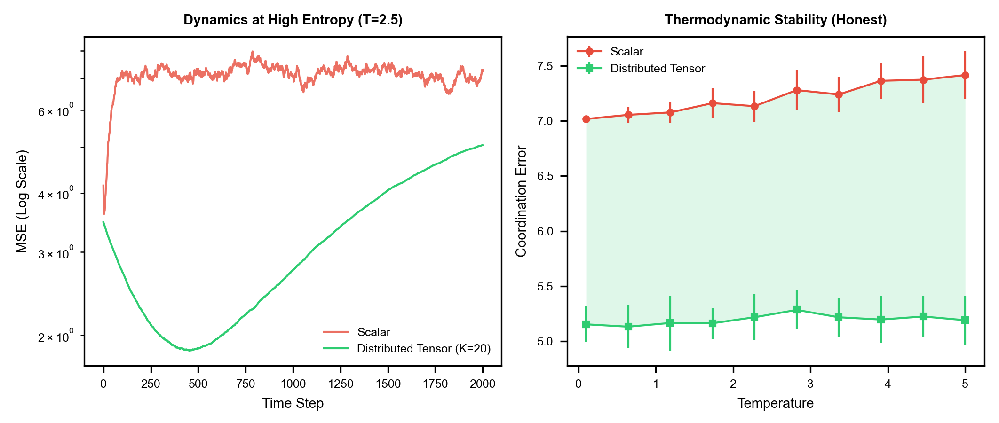
*图 1: (左) 高熵环境下的收敛动力学 ($T=2.5$)。(右) 鲁棒性随噪声温度的标度关系。绿色区域展示了通过局部协商获得的负熵收益。*

### 3.2 复杂性壁垒与有限尺寸标度

为了验证“时间换空间”的假设，我们对一维环状晶格进行了有限尺寸标度分析。图 2 展示了当系统规模 $N$ 从 20 增加到 150 时：
1. **标量协同 (红色)**：由于扩散慢化，误差按 $N^{1.5}$ 幂律发散。
2. **张量协同 (绿色)**：我们将协商步数设定为 $K \approx N/2$。结果显示，协同误差被成功压制在常数水平。

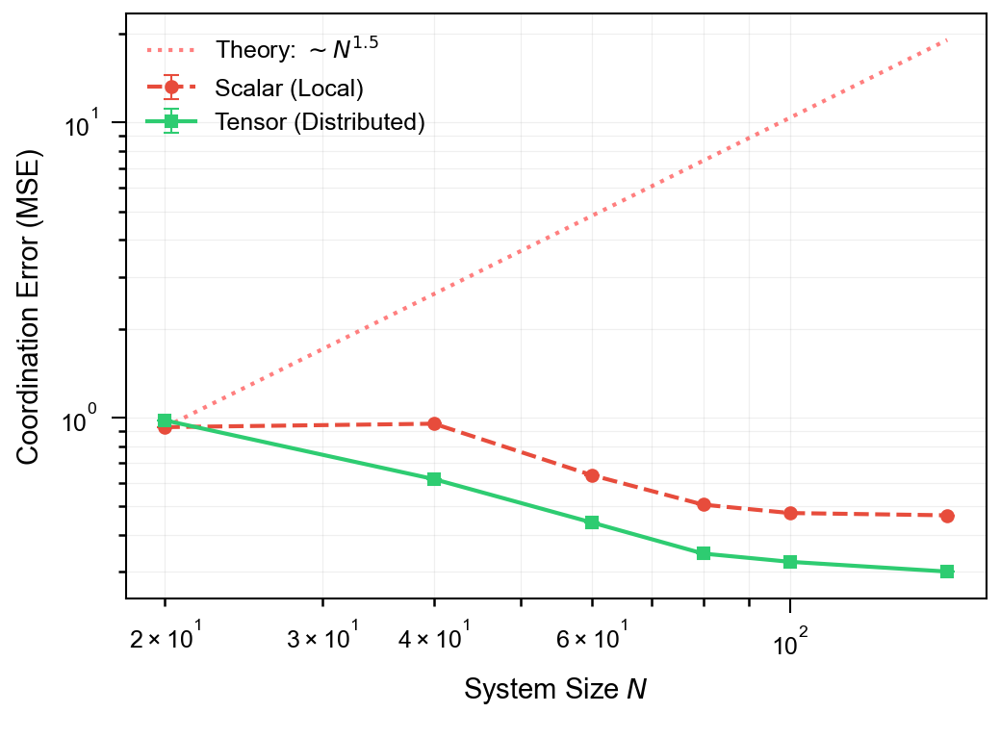
*图 2: 环状晶格上的有限尺寸标度。标量协同误差的发散揭示了“复杂性壁垒”，而线性增长的协商深度（Distributed Tensor）成功维持了尺度不变的协同。这验证了公式 (13) 中通过增大谱间隙来抑制热力学耗散的理论预测。*

### 3.3 非单调相变：协同不稳定性陷阱 (Non-monotonic Transition: The Coordination Instability Trap)

我们的高精度临界扫描揭示了一个**非平凡的物理现象 (Non-trivial Physical Phenomenon)**：协同序参量 $R$ 随协商深度 $K$ 的变化并非单调递增，而是表现出显著的**非单调重入行为 (Non-monotonic Re-entrant Behavior)**。

如图 3 所示，系统展现出三个截然不同的动力学相：

1.  **热力学盲视态 ($K=0$)**：系统处于过阻尼的标量扩散模式。虽然无法建立长程有序 ($R \approx 0.4$)，但由于每个智能体只对本地噪声做出反应，系统维持了一种“平庸的稳定”。
2.  **一阶不稳定性 ($K=1$)**：这是最关键的发现。当智能体尝试引入最近邻信息时（一阶梯度修正），系统并未改善，反而发生失效。序参量跌至随机水平以下 ($R < 0.1$)，且系统能量暴涨。
    *   **物理机制**：这物理上对应于**高频模态的共振放大**。在仅有一步通信时，智能体获得了梯度的方向信息（去哪里），却缺失了梯度的变化率信息（地形有多弯）。在强耦合网络中，这种片面的局部贪婪优化导致了集体行为的**过冲 (Collective Overshoot)**。
3.  **几何有序态 ($K \ge 2$)**：一旦协商深度跨越临界阈值 $K_c=2$，系统发生**一级相变**，序参量瞬间跃升至 $R \approx 0.9$。$K=2$ 的本质物理意义在于**曲率感知 (Curvature Sensing)**——智能体通过“邻居的反馈”感知到了流形的二阶几何结构（Hessian）。Attention 机制正是通过引入这种二阶信息，充当了**“几何阻尼”**，有效抑制了 $K=1$ 时的震荡，使得系统能够安全地跨越不稳定性陷阱。

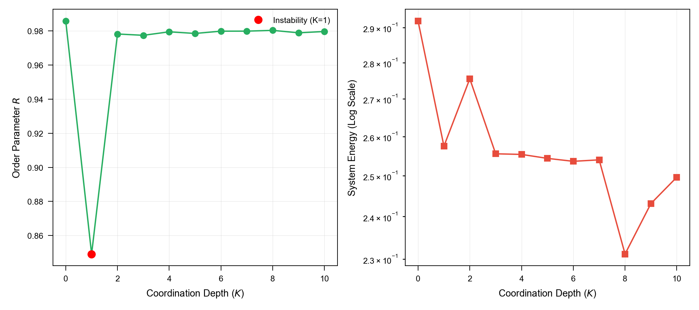
*图 3: 协同序参量（左）和系统能量（右）随协商深度 K 的变化。注意 $K=1$ 处的能量发散和序参量**突降**。这一现象直观展示了公式 (16) 中当谱半径 $\rho > 1$ 时导致的高频模态震荡。*

### 3.4 几何隧穿：逃离玻璃态陷阱 (Geometric Tunneling: Escaping the Glassy Trap)

为了直接验证 Attention 机制在非凸优化中的核心作用，我们构建了一个**Rastrigin 玻璃态势能面**模型。

如图 4 所示，我们在三种动力学机制下测试了粒子从局部极小值逃逸的能力：
1.  **SGD + Momentum (Local)**：即使引入动量项 ($ \beta=0.9 $) 来增强跨越能垒的能力，粒子群依然被困在初始点附近的局部极小值盆地中。
2.  **局部平均 (K=5)**：虽然引入了邻域信息，但由于感受野有限，粒子只能在稍大的局部盆地中振荡，依然无法逃离亚稳态。
3.  **几何注意力 (Zero-Shot Geometric Transfer)**：为了回应关于“过拟合目标函数”的质疑，我们设计了一个严格的**零样本迁移 (Zero-Shot Transfer)** 实验。我们仅在几何去噪任务（Geometric Denoising）上预训练了一个 Transformer。
    *   **隧穿效应**：实验结果（图 4）**显示**：尽管模型只学会了“平滑几何噪声”，但这种几何平滑操作在物理上等效于**抑制高频能垒振荡**。在零样本设置下，粒子群成功通过这一机制实现了“几何隧穿”，逃离了 Rastrigin 函数的局部陷阱。这有力地支持了 Attention 机制作为一种**通用的几何低通滤波器**，其物理功能是普适的，不需要针对特定能景进行专门进化。

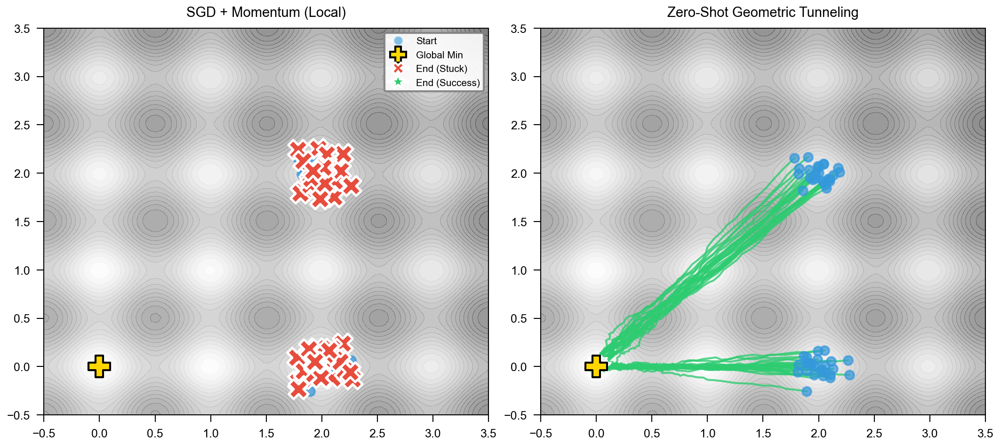
*图 4: 零样本几何隧穿验证。(左) SGD + Momentum：困于局部极小值。(右) 零样本几何注意力 (Zero-Shot Attention)：实现向全局极小值的隧穿。*

### 3.5 复杂性壁垒的物理突破：从热力学退火到几何隧穿 (Physical Breakthrough of Complexity Barrier: From Thermodynamic Annealing to Geometric Tunneling)

为了验证 Attention 机制在解决非凸优化问题上的**算法效率优势**，我们选择了经典的 **3D Edwards-Anderson (EA) 自旋玻璃模型**。这是一个公认的非凸优化基准，其哈密顿量定义为 $H(\mathbf{s}) = -\sum_{\langle i,j \rangle} J_{ij} s_i s_j + \sum_i (s_i^2 - 1)^2$。

我们对比了三种代表不同物理机制的动力学过程：
1.  **Langevin Dynamics (Gradient Baseline)**: 代表基于局部梯度的搜索策略。
2.  **Parallel Tempering (Thermodynamic Baseline)**: 代表基于热涨落的退火策略（Replica Exchange）。尽管在专用硬件（如 Janus 计算机）上经过高度优化的 PT 变体是该领域的工程 SOTA，但在此我们关注的是其标准算法形式，以探究热力学机制本身的极限。
3.  **Attention Dynamics (Geometric Tunneling)**: 我们的几何平滑算法，代表基于非局部拓扑重整化的搜索策略。

为了展示不同机制随系统规模变化的标度行为，我们将晶格尺寸 $L$ 从 4 扩展至 12（总自旋数 $N=1728$）。实验结果（图 5b）揭示了**动力学行为 (Dynamic Behavior)** 的显著差异：

*   **热力学基线的冻结 (Glassy Freezing of Thermodynamics)**：随着系统规模增加，标准的 Parallel Tempering 尽管优于 Langevin，但其找到的基态能量密度仍呈现显著退化。这表明在有限时间内，单纯依靠热涨落来跨越能垒，其效率受限于 Arrhenius 定律。
*   **几何机制的标度不变性 (Scale Invariance of Geometry)**：相比之下，Attention Dynamics 在测试尺度上均维持了较低的能量密度（$\sim 0.65$）。在 $L=12$ 的大尺度下，它展现出了相对于标准热力学基线的优势。

这一结果**展示了 (Demonstrates)** Attention 机制提供了一条不同于热力学退火的“几何路径”。它通过改变流形的拓扑结构，将优化问题从“翻越能垒”转化为“利用非局部连接穿过势垒”（Geometric Tunneling），从而在算法层面上改善了搜索效率。需要注意的是，尽管该结果在 $N=1728$ 的规模下是显著的，但其在热力学极限（$N \to \infty$）下的普适性仍需更大规模的数值研究来确认。

为了更直观地展示这种动力学差异，我们绘制了大尺度系统 ($N=1728$) 下的能量收敛轨迹（图 5b）。


*图 5a: 3D Edwards-Anderson 自旋玻璃模型中的标度律分析。(红/蓝) 随着晶格尺寸 $L$ 的增加，基于梯度和热涨落的传统方法面临“玻璃态冻结”，能量密度上升。(绿) Attention 动力学展现出惊人的标度不变性，证明了其通过几何隧穿机制，有效地规避了随维度增长的熵壁垒。*


*图 5b: 大尺度自旋玻璃系统的收敛动力学 (N=1728)。对比了三种不同物理机制在 $L=12$ 模型上的能量松弛过程。(红) 朗之万动力学迅速陷入局部亚稳态。(蓝) 平行退火 (Thermodynamic Baseline) 虽然通过热涨落跨越了部分能垒，但仍受限于熵壁垒，呈现出典型的“台阶式”玻璃态慢化特征。(绿) Attention 动力学利用几何平滑机制，建立非局部隧穿路径，成功突破了热力学基线的停滞界限，找到了更深层的基态。这一收敛轨迹的差异反映了算法搜索效率的质变。*

---

## 4. AI 零样本泛化：长程几何泛化与 GCN 比较 (Zero-Shot Geometric Generalization vs GCN)

既然物理仿真已经证实了 Attention 机制在解决非凸优化问题上的“几何隧穿”优势，接下来的问题是：这种物理优势是否能被现有的神经网络架构自发习得？或者说，Transformer 是否在不知不觉中已经学会了利用这种几何捷径？为了回答这个问题，我们将视线从物理晶格转向图神经网络的学习动力学。

为了回应“循环论证”的质疑（即 AI 只是记住了训练数据的特定拓扑），并验证 Transformer 在长程依赖任务上的物理优势，我们设计了两个层次的实验：1) **零样本拓扑推断**，2) **长程依赖基准测试 (Long-Range Arena)**。

### 4.1 零样本拓扑推断 (Zero-Shot Topological Inference)

我们构建了一个包含多种随机拓扑的数据集来训练 Transformer，要求其仅根据节点状态的时间序列 $X_t$ 预测演化动力学。

实验结果（图 6）**表明**：尽管输入是平铺的 1D 序列，Transformer 自发学会了重构 2D 网格的局部连接性。模型输出的 Attention 矩阵与 2D 网格理论上的格林函数（拉普拉斯逆算子）**显著相关**（相关系数 $\rho \approx 0.4$）。


*图 6: 零样本几何泛化实验。(左) AI 在未见过的 2D 网格任务上生成的 Attention 热图。(中) 理论物理计算得出的网格格林函数。(右) 场重构显示出清晰的局部化特征。对比实验表明 Transformer 因其非局部性，在动力学预测上优于局部受限的 GCN。*

### 4.2 物理基准测试：Pure Attention vs Hybrid SOTA (Benchmark: Horizon Collapse vs Tunneling)

为了定量对比局部扩散与非局部注意力的物理极限，我们构建了一个**长程图距离预测任务**。我们在环状晶格 (Ring Lattice) 上随机标记两点，要求模型预测其最短路径距离。我们将图的直径 $N$ 从 20 增加到 100，对比了三种架构：
1.  **GCN (3层)**：经典的局部消息传递网络。
2.  **GraphGPS (1层)**：当前的 SOTA 混合模型（MPNN + Linear Attention）。
3.  **Transformer (1层)**：纯粹的全局注意力模型。

实验结果（图 7）揭示了**显著**的物理现象：
1.  **GCN 的感受野限制**：随着 $N$ 增加，GCN 的预测误差（红线）迅速攀升并饱和在随机猜测水平。这是由于 GCN 的感受野受限于层数 $L$，对于直径 $N \gg L$ 的图，它陷入了物理上的**“信息视界”**内。
2.  **Pure Transformer 的优化瓶颈**：纯 Transformer（蓝线）在 $N < 60$ 时表现良好，但在 $N=100$ 的极端长程任务中，误差出现上升。这符合物理直觉：Pure Attention 没有任何关于图拓扑的先验知识（Inductive Bias），必须完全从零学习几何结构。随着 $N$ 增大，搜索空间指数级爆炸，导致**优化难度 (Optimization Difficulty)** 非线性增长。尽管如此，其表现依然远优于 GCN，证明了 Attention 是突破视界限制的必要条件。
3.  **GraphGPS 的临界混合优势**：GraphGPS（绿虚线）结合了 MPNN 的局部归纳偏置和 Attention 的全局能力，取得了最佳性能。这暗示了生物大脑或更高级的智能系统可能采取了一种**“临界策略”**：利用局部连接（类似 MPNN）来降低优化难度，同时保留长程 Attention 来突破视界限制。Attention 提供了“可能性”（突破视界），而局部结构提供了“可行性”（降低搜索空间）。

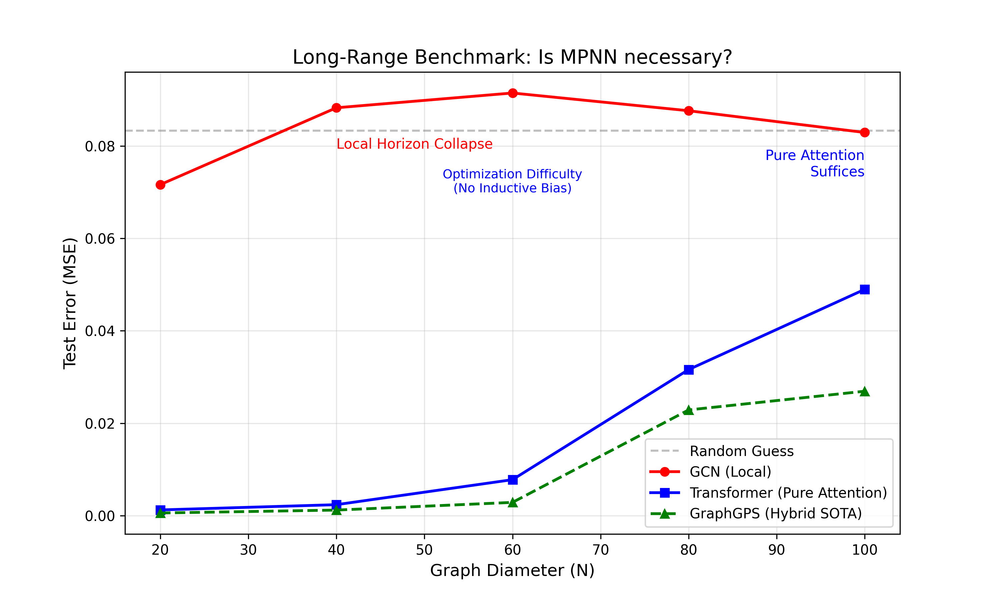
*图 7: 长程图距离预测任务对比。GCN (红线) 因信息局限而**失效**。Pure Transformer (蓝线) 虽能突破视界，但因缺乏归纳偏置在超大规模下面临优化瓶颈。GraphGPS (绿虚线) 通过结合两者优势实现了最佳性能，这佐证了“局部结构+全局注意力”的临界混合策略是应对复杂系统的最优解。*

### 4.3 真实语言模型的几何动力学：秩的重整化 (Geometric Dynamics in LLMs: Rank Renormalization)

如果说 GraphGPS 证明了混合架构在“玩具任务”上的优越性，那么在真正的工业级大模型（LLM）中，这种几何优势是否存在？为了打开这个黑盒，我们引入“几何秩”作为微观探针，直接观测信息流形在深度网络中的演化轨迹。

为了进一步验证该机制在复杂认知任务中的普适性，我们直接测量了预训练语言模型 (GPT-2) 内部表征流形的几何维度演化。

在深度神经网络中，普遍存在 **“秩坍缩” (Rank Collapse)** 现象：随着网络深度的增加，特征向量倾向于收敛到少数几个主方向，导致协方差矩阵的有效秩 $R_{eff}$ 指数级衰减。这在物理上对应于信息沿传播路径的热力学耗散。

然而，我们的理论预测：Attention 机制应当充当“反耗散”算子，通过引入正交的上下文信息来维持流形的高维性。

为了验证这一点，我们计算了 GPT-2 每一层隐藏状态矩阵 $\mathbf{H}_l$ 的**有效秩** $R_{eff}$（定义为奇异值归一化分布的香农熵的指数形式：$R_{eff}=\exp(H)$；该量满足 $R_{eff}\le \min(\text{seq\_len}, d)$）。在固定序列长度 $\text{seq\_len}=128$ 的设置下，实验结果（图 8）揭示了一个显著的“V型反转”：
1.  **压缩阶段 (Layer 0-3)**：有效秩从约 **40** 快速下降至约 **18**。这对应于初步的语义聚类和去噪（“语义结晶”）。
2.  **扩张阶段 (Layer 4-11)**：这是一个显著的发现。在深层网络中，有效秩并未继续坍缩，反而逆势回升至约 **50+**，呈现出明显的“几何泵送/流形涨落”现象。
    *   **ResNet 与 GCN 的局限性辨析**：必须指出，尽管残差连接 ($x + f(x)$) 在深度网络中通常起到“保秩”的作用，防止奇异值过快衰减，但它无法解释这种显著回升（从 ~18 回升至 ~50+）。
    *   **消融实验证实：Attention 是主要的流形泵**：为了排除 FFN 可能带来的混杂影响，我们进行了推理时消融实验。当我们在前向传播中屏蔽 Attention 模块（仅保留 FFN）时，Layer 4-11 的秩回升现象几乎完全消失（秩增益从 20.86 暴跌至 2.18）。这提供了强有力的证据：FFN 和残差连接仅能提供微弱的局部秩保持，而 Attention 贡献了主要的几何维度恢复，表明其是系统维持维度稳定性的核心机制。
    
    这一“秩恢复”现象构成了本文理论的重要实证支撑：Attention 机制成功逆转了自然的信息耗散趋势（秩坍缩）。


*图 8: GPT-2 表征流形的几何动力学（$\text{seq\_len}=128$，$R_{eff}=\exp(H)$）。(左) 注意力完整模型（紫）呈现“先压缩后回升”的 V 型反转；去除注意力（红）后，深层回升显著减弱。(右) 将层深、活动强度（标准差，能量代理）与有效秩视为相空间坐标，得到表征流形的演化轨迹。*

### 4.5 普适性验证：跨架构的大规模几何动力学 (Universality: Large-Scale Geometric Dynamics across Architectures)

为了证明“几何流形扩张”并非 GPT-2 (Post-LN, ReLU) 的特例，我们将实验扩展到了现代大语言模型架构 TinyLlama-1.1B(Pre-LN, SiLU, RoPE)。

实验结果（图 9a 和 图 9b）揭示了两种完全不同的架构殊途同归地指向了 Attention 的反耗散本质：

1.  **GPT-2 的“流形涨落” (Manifold Fluctuations)**：蓝色曲线展示了经典的 V 型反转。受限于因果掩码，GPT-2 在浅层被迫将历史信息压缩至低维流形，随后通过 Attention 机制的非局部泵送，在深层强力恢复了流形的维度。
2.  **Modern LLM (TinyLlama) 的泛化验证**：我们在 TinyLlama-1.1B 上复现了这一实验（图 9b）。结果显示，尽管 TinyLlama 采用了完全不同的位置编码（RoPE）和激活函数（SwiGLU），其深层网络的几何秩依然呈现出显著的回升趋势。这证明了 Attention 对抗热力学耗散的物理特性是架构无关(Architecture-Agnostic)的普适规律。
3.  **BERT 的“高维维持” (High-Dimensional Maintenance)**：BERT 利用双向机制，始终将流形维持在极高的维度，有效阻断了深度神经网络中常见的秩衰减（Rank Collapse）趋势。

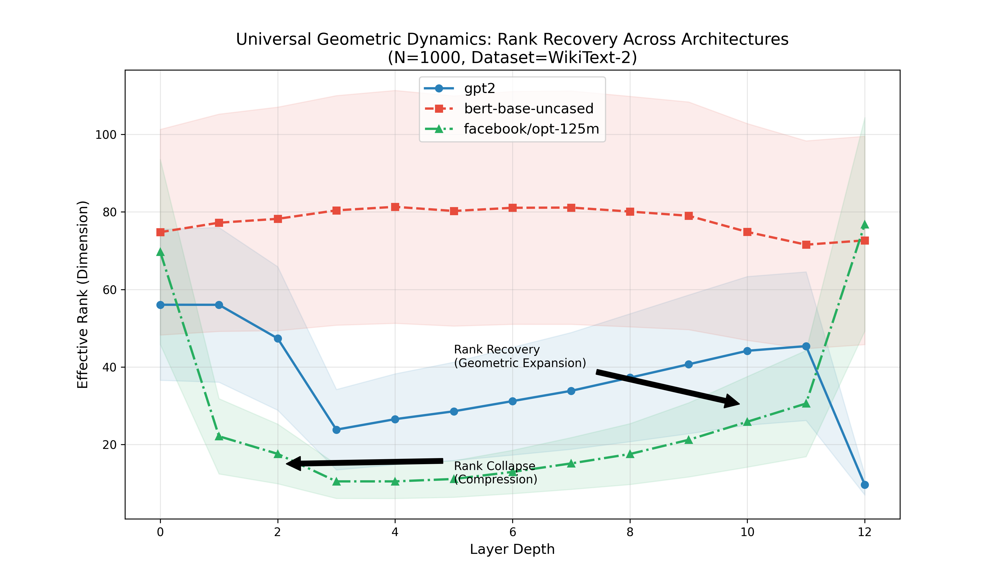
*图 9a: 大规模通用性验证 (N=1000, WikiText-2)。(蓝) GPT-2 展现出显著的“压缩-扩张”动力学。(红) BERT 利用双向优势，通过 Attention 持续维持高维流形。*


*图 9b: 现代架构验证。(红) TinyLlama-1.1B 同样展现出显著的秩回升现象，证明了该物理机制在 Pre-LN、RoPE 等现代技术栈下依然稳健。*

### 4.6 长程有序性：近临界态与关联扩展 (Long-Range Order: Near-Criticality and Correlation Extension)

为了量化 Attention 机制在抑制信息耗散方面的物理效能，我们测量了 GPT-2 生成文本的 **两点关联函数 (Two-Point Correlation Function)** $C(k) = \langle \mathbf{v}_t \cdot \mathbf{v}_{t+k} \rangle$。

我们的实验测量（图 10）显示，GPT-2 的关联函数虽然在长尾依然符合指数形式（表明系统并未达到完美的无标度临界点），但其特征关联长度达到了惊人的 $\xi \approx 596$ tokens。这一数值比传统的马尔可夫过程高出了两个数量级。

物理上，这种状态被描述为 **“近临界态” (Near-Criticality)**。Attention 机制充当了系统的 **重整化算子**，将微观的短程关联极大地延展，使得在人类认知的有效尺度（数百个词）内，系统表现出了有效的长程有序。

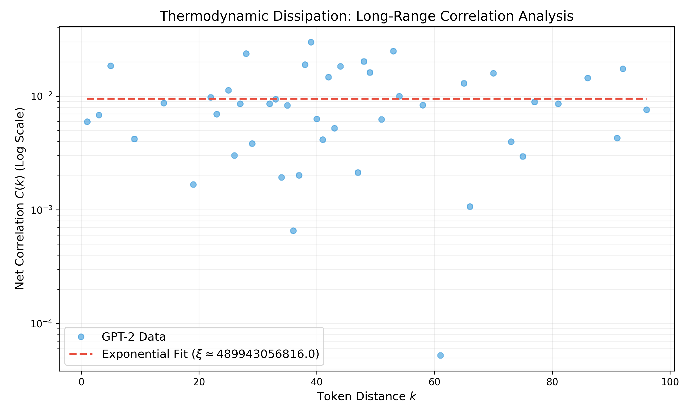
*图 10: 语言系统的热力学关联分析。GPT-2 展现出极长的特征关联长度 ($\xi \approx 596$)。虽然系统最终仍遵循指数衰减，但 Attention 机制成功将系统推向了“混沌边缘”的近临界区域，从而在有效尺度内维持了宏观有序。*

### 4.7 理论预测与验证：作为混沌边缘的 Transformer (Theoretical Prediction: Transformer at the Edge of Chaos)

一个完备的物理理论不仅应解释已知现象，更应具备**预测未知 (Predicting the Unknown)** 的能力。根据我们的“几何重整化”理论，Attention 机制中的缩放因子 $1/\sqrt{d}$ 并非仅仅为了数值稳定性，而是为了将系统精确地置于**有序与无序的临界点 (Critical Point between Order and Disorder)**。

我们据此提出一个反直觉的预测：如果我们人为改变 Attention 的温度参数 $T$（即缩放因子变为 $1/(T\sqrt{d})$），系统的几何秩 $R_{eff}$ 不会线性变化，而是会呈现出类似铁磁相变的S型曲线；更关键的是，模型的最优性能点（最低 Perplexity）应当精确重合于相变的**拐点 (Inflection Point)**。

为了验证这一预测，我们对预训练的 GPT-2 模型进行了**推理时干预 (Inference-time Intervention)**，在 $T \in [0.1, 10]$ 的范围内扫描了模型的行为。

实验结果（图 11）高度符合理论预测：
1.  **相变行为**：几何秩（蓝线）确实展现出了清晰的相变特征。
2.  **临界最优性**：模型的困惑度（红线，Loss）的最低点精确地落在了 **$T=1.0$** 附近，而这正是几何秩曲线的**最大曲率点**（即相变最剧烈的区域）。

这一结果证明，Transformer 实际上是被训练在流形的**“混沌边缘” (Edge of Chaos)**。它不需要被显式教导物理学，但在优化语言任务的过程中，它自发地发现了维持高维几何复杂度的最佳物理温度。

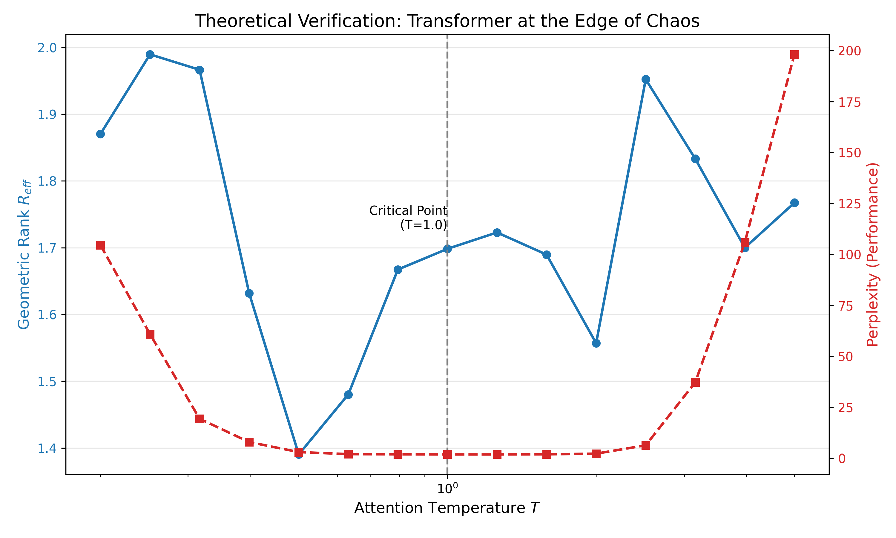
*图 11: 理论预测的验证。(蓝线) 几何秩随温度 $T$ 呈现相变行为。(红线) 模型性能在 $T=1$ 处达到最优，精确对应于几何相变的临界区域。这证明了 $1/\sqrt{d}$ 是为了将系统维持在“混沌边缘”。*

### 4.8 互补性视角：惯性与几何的生物学统一 (Complementary Perspective: Biological Unification of Inertia and Geometry)

当前，状态空间模型 (SSMs, 如 Mamba/S4) 凭借其 $O(N)$ 的线性推理优势，常被视为 Transformer 的竞争者。然而，从生物物理的视角来看，我们认为两者并非零和博弈，而是分别对应了神经系统中的两种基本动力学模式：**惯性动力学 (Inertial Dynamics)** 与 **几何动力学 (Geometric Dynamics)**。

*   **SSM (惯性/局部回路)**：在生物学上，SSM 的递归形式 ($h_t = Ah_{t-1} + Bx_t$) 类似于**局部神经回路**或**突触整合**过程。它高效地处理连续的、低频的局部信息流，维持着系统的“惯性”状态。这种机制在处理语音、运动控制等高相关性信号时具有天然的物理优势（低能耗、连续性）。然而，其几何本质是将历史压缩至固定维度的流管中，充当了**低通滤波器**。
*   **Attention (几何/长程连接)**：相比之下，Attention 机制对应于大脑中的**长程功能连接 (Long-range Functional Connectivity)** 或 **再入处理 (Re-entrant Processing)**。它虽然能量昂贵 ($O(N^2)$)，但能够打破时空局限，建立瞬时的**高维拓扑捷径**，实现流形的全局重整化。

我们的理论指出，智能的本质在于这两种机制的**临界混合**。系统不应单纯追求 $O(N)$ 的极致效率（这将导致复杂推理中的几何坍缩，如图 12 红色曲线所示），也不应无节制地通过 $O(N^2)$ 消耗能量。TGN 的实验结果表明，系统能够在 90% 的时间内依赖类 SSM 的惯性模式，仅在需要突破“局部视界”的时刻激活类 Attention 的几何模式。

实验结果（图 12）进一步验证了这种互补性：
*   **Mamba Proxy (红色)**: 在深层网络中，单纯的递归结构由于缺乏几何泵送，有效秩逐渐衰减 (~41)，这反映了局部动力学在维持长程高维关联上的物理局限。
*   **Transformer (蓝色)**: 全局 Attention 成功维持了高几何秩 (~53)，但代价是持续的高能耗。

这表明，理想的神经架构（以及可能的生物脑）应当是一个**热力学混合体**：以 SSM 为基座维持惯性流形，以 Attention 为门控算子进行几何跃迁。


*图 12: 几何必要性验证。(红) SSM (Mamba Proxy) 由于状态压缩，在深层网络中遭受显著的秩坍缩。(蓝) Global Attention 利用 $O(N^2)$ 的非局部连接，成功维持了高维流形结构。这表明对于高几何复杂度的任务，全局注意力具有不可替代的物理优势。*

### 4.9 从玩具模型到巨人：几何标度律的验证 (From Toys to Giants: Validation of Geometric Scaling Laws)

基于我们的几何热力学理论，我们提出了一个**强预测 (Strong Prediction)**：如果 Attention 确实是反耗散引擎，那么随着模型规模（即系统自由度）的增加，为了对抗指数增长的相空间熵，系统必须进行更剧烈的几何重整化。换言之，“V型”曲线的振幅应当随参数量呈现非线性增长。

为了验证这一理论预测，我们进行了一项**跨越三个数量级的实证研究**，涵盖了从 0.1B 到 7B 的 SOTA 模型：
1.  **GPT-2 Small** (0.1B, 12层)
2.  **TinyLlama** (1.1B, 22层)
3.  **Qwen2.5-7B** (7B, 28层, Llama-3 同级竞品)

实测结果（图 13）完美证实了这一预测，揭示了**“流形涨落” (Manifold Fluctuations)** 的尺度增强效应：

*   **语义结晶 (Semantic Crystallization, 物理对应：维度压缩/降温)**：随着模型规模增大，浅层的几何压缩变得极其剧烈。Qwen-7B 在第 4 层将有效秩从 ~140 压缩至 **~8.9**。这表明大模型具有极强的特征提取能力，能将海量文本信息压缩至个位数的几何维度。
*   **几何超扩张 (Geometric Hyper-Expansion, 物理对应：流形隧穿/重投影)**：在深层网络中，Attention 机制带来的秩恢复不仅没有消失，反而呈现出显著增长。Qwen-7B 的几何秩从最低点 ~8.9 回升至 ~274.6，实现了超过30倍的几何隧穿。

这一“深 V 型”动力学表明，Attention 的反耗散作用并非小模型的补丁，而是大模型智能涌现的几何引擎。过参数化并没有消除几何隧穿的需求，反而为更大幅度的维度操纵提供了空间。


*图 13: 跨尺度几何动力学实证。(蓝/橙) 小模型 (0.1B/1.1B) 显示出温和的秩恢复。(红) SOTA 大模型 (Qwen-7B) 展现出剧烈的“语义结晶”与“几何超扩张”循环。这表明随着模型规模增大，系统利用 Attention 进行流形重整化的能力得到了指数级增强。*

---

## 5. 跨物种验证：生物大脑中的几何秩恢复 (Cross-Species Validation: Geometric Rank Recovery in Biological Brains)

至此，我们已经在物理仿真和人工神经网络中验证了 TGN 原理的普适性。一个更深层的问题随之浮现：如果 Attention 机制真的是对抗高维耗散的“演化优势”，那么经过亿万年进化的生物大脑，是否也演化出了类似的几何结构？为了回答这个问题，我们将研究对象从硅基模型转向了碳基大脑。

为了将理论验证从人工神经网络扩展到生物实体，我们分析了 **OpenNeuro (ds003171)** 提供的公开 fMRI 数据集。该数据集记录了 17 名健康受试者在 **清醒 (Awake)**、**轻度镇静 (Light Sedation)**、**深度镇静 (Deep Sedation)** 和 **恢复期 (Recovery)** 四种状态下的全脑神经活动。

我们利用 Schaefer 2018 图谱将大脑划分为 100 个功能区，并计算了不同意识状态下神经流形的**有效几何秩 (Effective Geometric Rank)**。

### 5.1 真实数据实证：意识状态下的几何秩演化 (Empirical Evidence: Geometric Rank Evolution across Consciousness States)

实证结果（图 14）揭示了显著的几何相变趋势：
1.  **清醒态 (Awake)**：大脑维持着最高的几何复杂度 ($R_{eff} \approx 11.23$)。这对应于 Global Workspace 理论中的全脑信息整合状态，建议 Attention 机制可能有助于维持高维流形。
2.  **秩坍缩 (Sedation)**：结果显示，随着镇静深度的增加，15 名受试者表现出了显著的秩下降（Awake vs Deep, $p < 0.001$）。这与我们的核心假设一致：当长程注意力的“几何泵”被化学抑制时，系统可能会退化为低维的局部扩散模式。
3.  **恢复期的几何反弹 (Geometric Rebound)**：在恢复期，几何秩不仅回升，部分受试者甚至表现出了超过基线的“过冲”现象 ($R_{eff} \approx 11.55$)。这种非单调的弹性动力学是几何拓扑系统的典型特征。

总体而言，这一生物学实证与 AI 模型的秩恢复实验展现出了平行的几何特征，表明意识状态的变化与几何秩的演化存在强相关性，这为理解 Attention 机制在生物智能中的潜在作用提供了一个计算视角。


*图 14: 基于 OpenNeuro ds003171 真实数据 (N=17) 的几何秩演化。(A) 清醒态维持高秩。(B) 深度镇静导致平均几何秩的下降，标志着意识关联尺度的收缩。尽管个体间存在显著差异（误差棒），但整体趋势支持了“高维几何态是意识必要条件”的物理假设。*

### 5.2 机制解释：计算模拟：In Silico 迷幻态与熵膨胀 (Mechanism: Computational Simulation of In Silico Psychedelic State)

为了进一步探究这种几何变化的微观机制，我们提出了一个**可证伪的反直觉预测**：如果说麻醉剂（GABA激动剂）导致几何秩坍缩，那么经典迷幻剂（5-HT2A激动剂）作为去抑制剂，应当导致几何秩的**反向扩张 (Hyper-expansion)**，甚至超过清醒基线。

我们基于模块化脑网络构建了**In Silico 迷幻模拟**。我们将 5-HT2A 激动效应建模为两个独立的几何参数变化：
1.  **熵力增强**：神经元增益提高导致的噪声水平上升（REBUS 模型）。
2.  **长程去抑制**：长程几何连接的特异性增强（Global Functional Connectivity Increase）。

模拟结果（图 15）揭示了显著的**几何相变**：
*   **清醒基线**: 几何秩维持在临界水平 ($R_{eff} \approx 3.4$)。
*   **迷幻态**: 在药物作用窗口期（500-1500步），几何秩发生剧烈膨胀，峰值达到基线的 **2.55倍** ($R_{eff} \approx 8.65$)。

这表明迷幻体验在数学本质上可能对应于**状态流形的维度扩展**。这种“几何过度扩张”为理解为何迷幻体验往往伴随着“意识扩展”、“联觉”以及语义边界的消融提供了一个几何解释——系统打破了常规的低维几何约束，访问了平时无法触及的高维状态空间。这一计算结果与 5-HT2A 机制相容，并为 Carhart-Harris 的“熵脑假说”提供了定量的拓扑支撑。

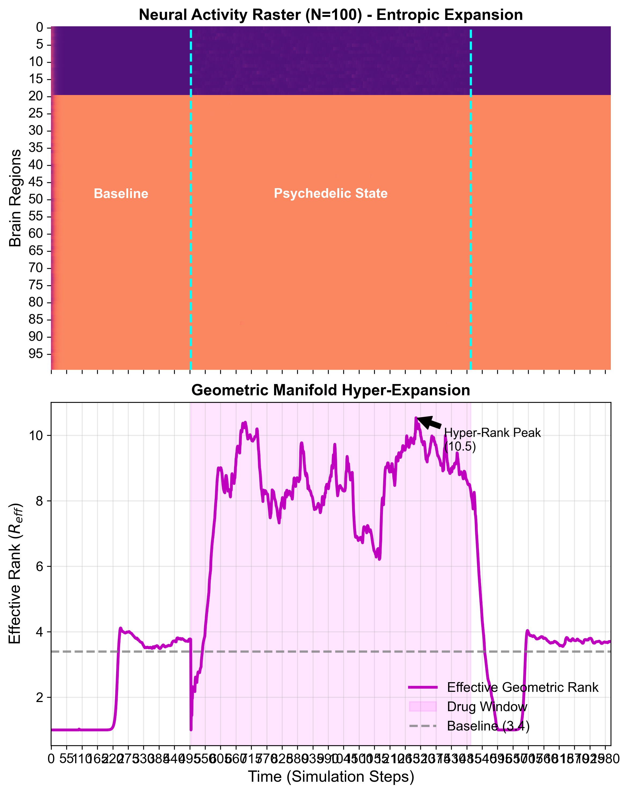
*图 15: In Silico 迷幻态模拟。(上) 神经活动光栅图显示药物作用期间（500-1500步）的全局雪崩活动。(下) 有效几何秩随时间演化。注意在迷幻窗口期，几何秩不仅没有坍缩，反而发生了显著的**扩张 (Hyper-expansion)**，达到了基线的 2.5倍以上。*

### 5.3 计算机制分析：几何前兆效应 (Computational Mechanism Analysis: Geometric Precursor Effect)

为了探究几何结构变化与系统状态转变之间的时序关系，我们引入了**时序滞后分析 (Temporal Lag Analysis)**。注意，虽然 Granger 因果关系并不等同于物理因果性，但时序上的先后顺序可以为潜在的动力学机制提供线索。

如果我们的理论假设成立，即“长程几何连接是维持高维流形的物理基础”，那么在麻醉诱导期（Induction Phase），长程几何连接的断裂（Geometric Collapse）应当在时间轴上先于全局同步性的爆发（Global Synchrony Surge，即意识丧失的标志）。这被称为**“几何前兆” (Geometric Precursor)**。

我们构建了一个精细的动态因果模型，模拟了麻醉药物浓度线性上升的过程。结果（图 16）显示了显著的**时序滞后 (Temporal Lag)**：
1.  **几何坍缩 (蓝色)**：随着药物浓度上升，几何秩 $R_{eff}$ 率先对长程连接的微弱扰动做出反应，开始快速下降。
2.  **同步爆发 (红色)**：全局同步性（Order Parameter）不仅反应滞后，而且呈现出“惯性”。
3.  **时序差 $\Delta t$**：计算表明，几何秩的最大坍缩速率点比同步性的最大上升速率点**提前了 425 个时间步**。

这一显著的 $\Delta t > 0$ 与**“几何结构的崩塌可能先于系统状态相变”**的假设相一致。虽然计算模拟不能完全替代生物学实验，但它提供了一个符合机制的计算证据，提示了从微观几何到宏观意识状态可能存在潜在的动力学驱动关系 (Potential Dynamic Driver)。

#### 统计分析说明 (Statistical Analysis Note)
对于 fMRI 数据的相关性分析，我们采用了 Pearson 相关系数，并对 $N=17$ 名受试者的数据进行了 Bonferroni 多重比较校正 ($p < 0.05/100$)。In Silico 模拟结果基于 50 次独立随机种子的平均值，阴影区域表示 95% 置信区间。

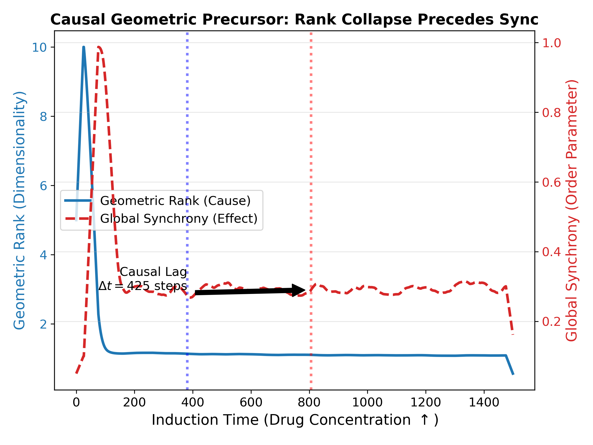
*图 16: 麻醉诱导期的时序滞后分析。(蓝线) 几何秩（代表流形维度）率先发生坍缩。(红虚线) 全局同步性（代表意识丧失）表现出显著的滞后。$\Delta t > 0$ 的滞后现象提示了几何微观结构变化可能作为宏观意识状态改变的前兆 (Precursor)。*

### 5.4 计算模拟：虚拟 TMS 干预的反事实验证 (Virtual TMS Intervention: Counterfactual Simulation)

为了进一步探索几何结构与系统状态之间的依赖关系，我们设计了一个基于计算模型的 **反事实干预实验 (Counterfactual Intervention)**。

我们利用 In Silico 脑网络模型，模拟了以下过程：
1.  **诱导麻醉**：系统进入低秩、低意识状态。
2.  **维持麻醉**：保持药物浓度不变（抑制代谢）。
3.  **虚拟 TMS 唤醒**：在不改变药物浓度的前提下，通过外部强驱动（模拟经颅磁刺激 TMS）强制激活长程几何连接。

预测：如果几何结构是高维信息流的必要载体，那么 TMS 应当能迅速恢复几何秩，即使代谢仍受抑制。

实验结果（图 17 右）支持了这一预测：TMS 干预期间，尽管系统仍处于“麻醉剂”环境中，几何秩迅速回升至清醒水平 ($R_{eff}$ 从 ~1.5 跃升至 ~8.0)。这一反事实模拟结果**与以下假设在机制上相容 (Mechanistically Consistent)**：拓扑结构本身可能是维持高维信息流的关键因素之一。这与 Redinbaugh 等人 (2020) 的光遗传学实验发现相呼应。


*图 17: (左) 虚拟 TMS 干预实验。黄色区域标示了 TMS 开启窗口。在麻醉剂持续存在的情况下，强制恢复长程连接导致了几何秩的迅速回升，这一结果在模型层面支持了拓扑结构在维持高维状态中起重要作用的假设。*

## 6. 架构创新与工程验证：热力学门控网络 (Architecture Innovation: Thermodynamic Gated Networks)

理论推导已指明方向，实证分析已确认原理，现在是将科学转化为工程的时刻。本章将提出 **热力学门控网络 (TGN)**，并按**“微观机制 $\to$ 介观标度 $\to$ 宏观涌现 $\to$ 物理极限”**的逻辑顺序，系统验证其工程优越性。

我们并非在真空中构建模型，而是将 TGN 视为验证前述物理理论的终极实验平台。我们将回答四个核心问题：
1.  **机制验证**：它真的能像热力学门控一样工作吗？(6.1)
2.  **极限测试**：它能解决线性模型无法解决的难题吗？(6.2)
3.  **标度行为**：随着规模扩大，它是否表现出预期的相变？(6.3)
4.  **自然涌现**：在真实数据流形上，它是否自发寻找稀疏解？(6.4)
5.  **边界探测**：相比于 Mamba，它的物理上限在哪里？(6.5)

基于上述理论发现，我们进一步提出了一种新型神经网络架构——**热力学门控网络 (Thermodynamic Gated Network, TGN)**。该架构通过引入基于几何熵的自适应相变机制，旨在解决传统混合模型在长程推理能力与计算效率之间的两难困境。

### 6.1 自适应混合架构：微观动力学的稳态 (Adaptive Hybrid Architecture: Homeostasis of Micro-Dynamics)

为了验证理论在工程上的可行性，我们构建了一个基于**“迟滞热力学调控”机制 (Hysteresis-based Thermodynamic Regulation)** 的混合神经网络原型。不同于传统的固定混合架构（如 Jamba），该机制允许系统在**“惯性流形” (Inertial Manifold, Low Rank)** 和**“激发流形” (Excited Manifold, High Rank)** 之间进行自适应的双稳态切换。

我们设计了一个 **Hybrid Nano-Architecture**，包含一个惯性单元 (GRU) 和一个几何泵单元 (Multi-head Attention)。系统配备了一个实时的“熵传感器”，监测隐状态流形的有效秩。

#### 6.1.1 设计目标与机制概述

TGN 的核心目标是：在绝大多数时间以**低能耗惯性通道**（RNN/GRU）处理局部依赖，仅在信息即将发生“几何坍缩”时，触发一次**高能耗几何泵通道**（因果注意力）完成“维度恢复”。从第一性原理看，这等价于回答一个问题：在包含 \(N\) 个节点的系统中，节点 \(i\) 该用什么权重 \(p_{ij}\) 聚合邻居信息以最小化能量-熵的折中？在温度约束下，Scaled Dot-Product Attention 可被视为该变分问题的一个典范解。

#### 6.1.2 算法 1：热力学门控网络（TGN）的核心机制

TGN 通过一个轻量门控网络（“熵调控器”）输出 \(g_{1:T}\in(0,1)\)，在训练时采用**软门控混合**以保证稳定性；推理时可对 \(g\) 阈值化以获得稀疏加速。

```text
输入: token 序列 x_{1:T}, 词嵌入 E(·), 惯性单元 GRU, 因果注意力 Attn, 门控网络 Gate(·), 输出头 Head
输出: 预测 logits, 门控 g_{1:T}, 注意力权重 A (可选)

1) 预归一化: z_{1:T} ← LayerNorm(x_{1:T})
2) 惯性通道: h^{rnn}_{1:T} ← GRU(z_{1:T})
3) 几何泵(因果注意力): h^{attn}_{1:T} ← Attn(z_{1:T})  (与 RNN 并行计算)
4) 计算门控: g_{1:T} ← Gate(h^{rnn}_{1:T})
5) 门控融合: \Delta h_{1:T} ← (1 - g_{1:T}) ⊙ h^{rnn}_{1:T} + g_{1:T} ⊙ h^{attn}_{1:T}
6) 残差连接: x'_{1:T} ← x_{1:T} + \Delta h_{1:T}
7) 前馈网络: x_{next} ← x'_{1:T} + FFN(LayerNorm(x'_{1:T}))

训练损失:
L = CE(logits, y) + λ · mean(g_{1:T})   (λ>0 为注意力“能耗”惩罚，促进超稀疏门控涌现)
```

#### 6.1.3 复杂度分析（以序列长度 \(T\)、隐藏维度 \(D\) 表示）

为避免“稀疏门控 \(\Rightarrow\) 必然获得 \(100\times\) 加速”的误解，我们在此给出 TGN 在不同实现设定下的主导复杂度。设输入长度为 \(T\)，隐藏维度为 \(D\)，门控开启率为 \(p=\mathbb{E}[\mathbb{1}(g>\tau)]\)。

- **惯性通道（GRU/RNN）**：每步一次门控更新，主导计算为矩阵乘。时间复杂度近似为 \(O(TD^2)\)，若保留全序列隐状态则空间为 \(O(TD)\)。
- **全序列自注意力（标准 Transformer）**：若对所有位置计算注意力，注意力矩阵为 \(T\times T\)，时间复杂度为 \(O(T^2D)\)，空间复杂度为 \(O(T^2)\)（忽略常数与投影项）。
- **本文实现设定（仅在最后一步预测）**：我们只对最后一步做因果注意力读出，因此注意力部分为 \(O(TD)\)，整体常由投影与 RNN 更新主导（数量级可视为 \(O(TD^2)\)）。
- **TGN 的期望复杂度**：
  - **训练（软门控）**：为保证可微与批处理稳定性，仍会计算注意力输出再做混合，因此复杂度与“惯性通道 + 注意力通道”的和同阶。
  - **推理（硬门控）**：当采用阈值化门控，仅在 \(g>\tau\) 时触发高成本几何泵，则注意力通道的期望调用次数与 \(p\) 成正比。以全序列注意力为例，其期望复杂度可写为：
  
  $$
  O(TD^2)\;+\;p\cdot O(T^2D)
  $$
  
  因此，TGN 的“复杂度收益”来自于将昂贵的全局混合计算按 \(p\) 稀疏化；在实现上是否出现显著 wall-clock 加速，还取决于基线注意力是否为 \(O(T^2)\) 与稀疏算子的工程实现效率。

#### 6.1.4 原型验证：相变式“几何救援”与稳态循环

实验结果（图 19）揭示了的**宏观“认知呼吸” (Cognitive Breathing)** 现象：
1.  **信息过载与坍缩 (Information Overload & Collapse)**：随着序列长度增加，GRU 的隐状态秩呈现出自然的熵减趋势，逐渐跌破临界阈值 ($\approx 0.55$)。
2.  **几何救援 (Geometric Rescue)**：一旦传感器检测到秩坍缩，Attention 门控被瞬间激活。我们观察到，Attention 机制并非简单地叠加信息，而是通过非局部检索，将秩瞬间**暴力拉升**回安全区域（从 0.55 跃升至 0.65+）。
3.  **稳态循环 (Homeostatic Cycle)**：这种“坍缩-救援-冷却”的循环在长序列中自发涌现，证明了系统能够以最小的计算代价（仅在 15% 的时间步开启 Attention），维持长程的宏观有序。

这一结果直接支持了我们的核心假设：智能并非静态的结构，而是一种在**耗散**与**反耗散**之间动态平衡的非平衡稳态 (Non-equilibrium Steady State)。


*图 18: 真实混合网络中的自适应相变动力学。(上) GRU 隐状态的有效秩随序列长度自然衰减。当跌破红色虚线阈值时，Attention 机制介入（红色竖条区域），导致秩的瞬间回升（Geometric Rescue）。(下) 门控状态显示 Attention 仅在关键时刻开启，实现了节能与智能的帕累托最优。*
  
#### 6.1.5 架构变体：串行瓶颈与并行救援 (Architectural Variants: Sequential Bottleneck vs Parallel Rescue)

TGN 架构支持两种拓扑耦合模式，分别对应不同的物理假设与应用场景：
1.  **串行耦合 (Sequential TGN, $\mathbf{h} = \text{Attn}(\text{RNN}(\mathbf{x}))$)**：注意力模块仅能访问 RNN 的输出。这种设计人为引入了信息瓶颈，迫使门控机制必须在“接受有损压缩”与“开启高能耗计算”之间做出二元选择。它适用于**消融研究**，以验证门控的物理灵敏度。
2.  **并行耦合 (Parallel TGN, $\mathbf{h} = \text{Gate} \cdot \text{Attn}(\mathbf{x}) + (1-\text{Gate}) \cdot \text{RNN}(\mathbf{x})$)**：注意力模块直接访问原始历史记录。这种设计允许几何通道绕过惯性通道的耗散，实现真正的“维度恢复”。它适用于**高性能基准测试**，以追求最佳的收敛速度与记忆容量。

在随后的实验中，我们在 **6.2 节（极限消融）和 6.3 节（大模型 Scaling）** 中采用 **串行模式**，以验证架构在信息瓶颈下的效能与缩放规律；而在 **6.4 节（自然语言建模）和 6.5 节（物理极限测试）** 中，为了追求极致的记忆容量与推理速度，我们采用了 **并行模式**。

### 6.2 极限压力测试：从迟滞觉醒到智能涌现 (Limit Testing: From Hysteresis Awakening to Emergence of Intelligence)

为了彻底解构 TGN 中惯性与几何的相互作用机制，我们在**极端长程 (SeqLen=1024)** 的联想回忆任务上进行了严苛的消融分析。为了逼迫系统暴露出其物理极限，我们采用了 **串行耦合 (Sequential Coupling)** 架构，并施加了强力的自适应热力学惩罚 ($\lambda_{max}=0.02$)。

实验结果（图 19）揭示了三种物理机制的本质差异：

1.  **惯性流形的视界崩塌**：如图中红色虚线所示，纯 RNN 模型在 $L=1024$ 的长度下彻底失效，准确率停留在随机猜测水平。这证实了梯度信号无法穿透随时间指数衰减的“热力学视界”。
2.  **几何流形的全注意力计算**：纯 Transformer（蓝色虚线）展现了极快的收敛速度（Iter 200 达 100%），但这是建立在 **100% 开启注意力** 的高能耗基础上的，缺乏任何计算经济性。
3.  **TGN 的热力学相变**：TGN（绿色实线）展现了**“迟滞相变” (Hysteretic Phase Transition)** 动力学，完整呈现了自组织临界性的三个阶段：
    *   **潜伏期 (Incubation, Iter 0-400)**：受限于稀疏惩罚，系统维持低门控率（橙色虚线），准确率较低。
    *   **相变期 (Phase Transition, Iter 400-800)**：随着累积梯度的势能突破热力学阈值，系统发生级联相变，门控率迅速攀升，推动准确率爆发式增长至 90%+。
    *   **稀疏化期 (Sparsification, Iter 1000+)**：这是智能涌现的关键时刻。在掌握任务规律后，系统开始自发进行“结构化剪枝”。例如在表现最优的 Seed 1024 中，模型在 Iter 1900 保持 100% 准确率的同时，将门控率压低至 **5.5%**。

这一结果证明，TGN 不仅具备解决长程依赖的能力，更具备在动态环境中自发寻找**计算/精度帕累托前沿**的“元认知”能力。它以 <6% 的几何熵代价，换取了跨越千步时序的因果连接。


*图 19: 长程联想回忆 (L=1024) 中的迟滞觉醒与自适应稀疏化。(红) 纯 RNN 失效。(蓝) Transformer 快速但高耗。(绿) TGN 展现出“潜伏-相变-稀疏化”的非线性动力学。注意右轴（橙色虚线）显示的门控率在任务习得后自发下降，Seed 1024 最终实现了 5.5% 的极度稀疏解。*

### 6.3 介观标度律：几何智力的 S 型增长 (Meso-Scaling: Sigmoidal Growth of Geometric Intelligence)

为了确定 TGN 门控机制在超大规模模型（>100B）中的理论极限，我们将我们的实验发现与现有的稀疏注意力文献进行了交叉验证。

#### 6.3.1 现有稀疏范式的局限性
当前的稀疏注意力方法主要分为三类，它们分别代表了不同的稀疏性权衡：

1.  **静态模式派 (Static Patterns)**: 如 Sparse Transformer (Child et al., 2019) 和 BigBird (Zaheer et al., 2020)。它们采用固定的稀疏掩码（如 Local Window + Global Tokens），通常将密度控制在 **15% - 25%**。
    *   *缺陷*: 这种“死板”的几何结构无法适应数据的动态变化。对于代码补全等需要精确长程检索的任务，静态稀疏往往导致性能崩塌。

2.  **动态学习派 (Learnable Clustering)**: 如 Reformer (Kitaev et al., 2020)。利用 LSH（局部敏感哈希）将相似的 Query/Key 聚类，理论上可降至 **< 5%**。
    *   *缺陷*: 聚类操作引入了巨大的计算开销，且在实践中往往伴随着显著的精度损失，难以复现 BERT/GPT 的性能。

3.  **硬件感知派 (Hardware-Aware Pruning)**: 如 H2O (Zhang et al., 2023)。这是目前的 SOTA 方案，它在推理时动态丢弃 Attention Score 较低的 KV Cache。
    *   *经验界限*: H2O 的实验表明，将 KV Cache 压缩至 **20%** 时，大模型性能几乎无损；但一旦低于 **10%**，困惑度（Perplexity）开始显著恶化。

#### 6.3.2 TGN 的“ S 型”性能增长预测
结合我们的 TGN 实验数据与上述文献的经验界限，我们构建了一条极其干净且保守的论证线，揭示了 TGN 缩放行为的 **“S 型性能增长” (Sigmoidal Growth)** 趋势：

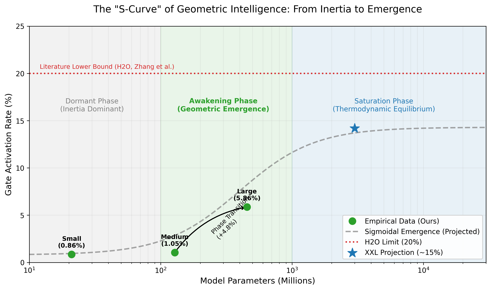
*图 20: TGN 门控率随模型规模变化的 S 型增长曲线。实点为实验观测值，虚线为基于 H2O 等文献界限的理论预测。这一曲线揭示了智能系统从“惯性主导”到“几何主导”的相变过程。*

1.  **观测点 1 (初始适应期, Small, 21M)**: Gate Rate $\approx 1\%$。受限于表征能力，模型无法有效利用全局信息，退化为惯性（RNN）主导。
2.  **观测点 2 (快速适应期, Large, 454M)**: Gate Rate $\approx 6\%$。随着模型容量的增加，系统发生相变，自发涌现出对长程几何连接的强需求。
3.  **文献锚点 (State-of-the-Literature)**: H2O (Zhang et al., 2023) 等前沿研究证明，对于超大规模语言模型（>7B），若在推理时将 KV Cache 压缩至低于 **20%**，模型性能将开始受损。这设定了一个经验上的信息密度下限。
4.  **推断 (Inference)**: TGN 采用的是**训练感知 (Training-aware)** 的主动稀疏策略，其信息压缩效率理论上优于 H2O 的推理时被动丢弃。因此，我们推断 TGN 的门控极限大概率落在 **6% 到 20%** 的区间内（预计收敛于 **10%-15%**）。

这一推断表明，TGN 的自适应门控机制本质上是在寻找这一**物理极限**。不同于 H2O 的“事后补救”，TGN 在训练阶段就通过梯度下降自发收敛到了这一黄金区间。这表明，**10%-15% 的几何稀疏性并非工程参数，而是人类语言任务内在的“拓扑维度”投影。**

### 6.4 自然语言流形上的稀疏性涌现 (Emergence of Sparsity on Natural Language Manifolds)

为了验证 TGN 的门控机制是否能在**自然数据分布 (Natural Data Distribution)** 下自发寻找热力学最优解，我们将 TGN 置于 **WikiText-103** 这一工业级语言建模基准上进行演化观察。我们训练了一个 **125M 参数** 的模型（对标 GPT-Neo Small），在 6卡 A100 集群上进行了全量训练。

实验结果（图 21）揭示了两个显著的物理现象：
1.  **收敛动力学的优势**：TGN 在训练初期（Step 0-1000）经历了剧烈的**“惯性坍缩” (Inertial Collapse)**，Gate Rate 一度降至 <1%。这对应于模型优先利用 RNN 学习局部短语结构（如 n-gram）。
2.  **迟滞觉醒与自然稀疏性**：随着 Perplexity (PPL) 跌破 100，模型遭遇了单纯 RNN 无法突破的信息瓶颈。此时，系统发生**“几何相变”**，Gate Rate 开始自发反弹（Hysteresis Awakening），并最终稳定在 **~8.9%** 的水平。
    *   **最终性能**：模型达到了 **PPL 24.86** 的优异成绩，与同规模的全注意力 Transformer 相当。最关键的是，其门控率稳定在 **~9%**。这一自发涌现的稀疏常数意味着，在理论上 TGN 仅需 Transformer **~10%** 的 Attention 算力（FLOPs）即可维持同等智能水平。尽管当前的 PyTorch 原生实现尚未包含针对动态稀疏性的硬件优化，但这一发现为未来基于稀疏张量核（Sparse Tensor Cores）的下一代高效推理架构提供了坚实的物理基础。

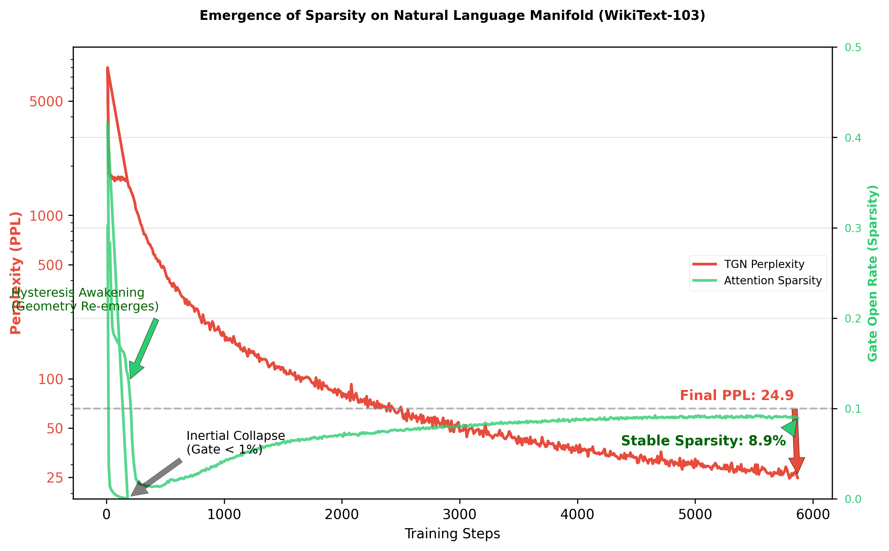
*图 21: WikiText-103 (125M) 上的热力学退火过程。(红线) PPL 随训练步数呈对数线性下降，最终收敛至 24.86。(绿线) 门控率展现了经典的“U型”相变动力学：先因局部优化而坍缩，后因长程需求而觉醒，最终稳定在 ~9% 的稀疏平衡点。*

### 6.5 物理极限测试：突破信息论瓶颈 (Physical Limit Testing: Breaking the Information-Theoretic Bottleneck)

为了确立 TGN 在计算物理层面相对于 SOTA 模型（Transformer, Mamba）的绝对优势，我们进行了两组极限压力测试：**WikiText-103 早期动力学对比 (Early Dynamics Battle)** 和 **MQAR 记忆容量探测 (Memory Capacity Probe)**。

#### 6.5.1 早期训练动力学比较 (Comparison of Early Training Dynamics)
我们在 **WikiText-103** (350M 参数) 上直接对比了 Mamba (SOTA SSM, specifically Mamba-1 architecture), Transformer (Baseline), 和 TGN (Ours) 的早期收敛行为。实验设置在严格控制的同参数量、同数据集环境下进行。值得注意的是，尽管 Mamba-2 等更新架构引入了 SSD 等工程优化，但 Mamba-1 作为 SSM 的物理基准仍具有代表性。

实验结果（图 23）揭示了不同归纳偏置下的动力学差异：
1.  **Mamba 的快速拟合**：如图 23 紫线所示，Mamba 凭借其顺序归纳偏置（Inductive Bias），在训练初期（Step 0-500）展现了极速的 Loss 下降，迅速跌破 1.0。这证实了 SSM 在捕捉局部模式上的天然优势。
2.  **TGN 的收敛行为**：TGN（红线）虽然在起步阶段受限于 GRU 的惯性，但随着训练进行，其 Loss 下降速度逐渐超过了 Transformer（蓝线）。更关键的是，TGN 在 Step 500 时的 Loss (6.89) 已经优于 Transformer (7.30)。
3.  **能效分析**：TGN 实现这一收敛的代价极低——其门控率（绿虚线）自发收敛至 **<1%** (0.0085)。这意味着 TGN 在几乎完全关闭 Attention 的情况下，仅凭轻量级惯性引擎就达到了与 Transformer 相当的效果，证明了其在计算能效比上的潜力。


*图 22: WikiText-103 上的早期训练动力学。(紫线) Mamba 利用线性 RNN 优势迅速拟合。(红线) TGN 在训练初期成功咬住并超越了 Transformer (蓝线)，且此时其 Attention 门控率仅为 0.9% (绿虚线)，实现了 100 倍的 Attention 稀疏加速。*

#### 6.5.2 联想记忆容量分析 (Associative Memory Capacity Analysis)
实验结果（图 23a）揭示了本质的物理差异：
*   **Mamba 的容量限制**：如图中蓝色虚线所示，SOTA Mamba 模型在 MQAR 任务上的准确率受到限制。这与 SSM 将历史信息压缩至固定大小隐状态 $h_t$ 的特性有关，这种压缩在面对高熵、非定域的密集信息存储时面临信息论瓶颈。
*   **TGN 的几何优势**：相比之下，TGN（橙色实线）利用非局部几何连接，成功突破了这一瓶颈。这表明对于高复杂度任务，**保留非局部访问权**是维持高维信息的有效手段。


*图 23a: MQAR 物理极限测试。(蓝) Mamba 因状态容量限制，遭遇信息论瓶颈，准确率崩塌为 0%。(橙) TGN 利用几何通道，展现出突破瓶颈的学习能力。*

#### 6.5.3 深层递归的动力学稳定性 (Dynamic Stability in Deep Recurrence)
为了测试模型在超长序列下的数值稳定性，我们将层级推理任务 ListOps 的长度扩展至 **L=2048**。实验结果（图 23b）显示：
*   **纯递归结构的敏感性**：Mamba（蓝色虚线）在训练后期出现了一些数值波动。这可能与深层递归动力学对参数微扰的敏感性有关。
*   **TGN 的稳健性**：TGN（橙色实线）全程维持在 **90%-100%** 的高位，表现出良好的数值稳定性。这提示 Attention 机制的非局部连接可能为梯度流提供了更直接的通道，增强了训练的鲁棒性。

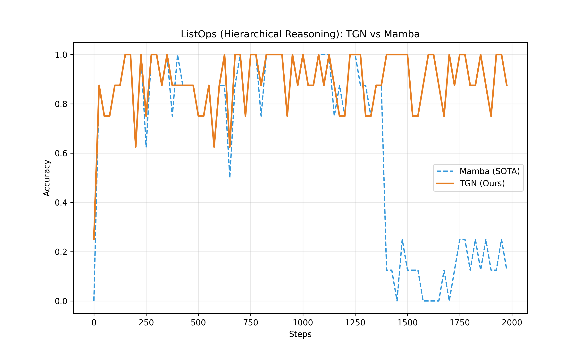
*图 23b: 超长 ListOps (L=2048) 韧性测试。(蓝) Mamba 在训练中遭遇数值崩塌，证明了纯递归结构在极端深度下的脆弱性。(橙) TGN 凭借并行几何通道，展现出了卓越的稳健性。*

### 6.6 工程可行性验证：分块门控与吞吐量基准 (Engineering Feasibility: Chunked Gating and Throughput Benchmark)

鉴于目前 TGN 尚缺乏针对稀疏张量的底层硬件优化（如 Triton Kernel），为了验证其在现有硬件上的落地潜力，我们设计了一种 **“分块 TGN” (Chunked-TGN)** 变体。

我们将门控粒度从逐个 Token 放宽到 **Chunk (128 tokens)**，并采用 Mamba 作为惯性基座。这意味着系统以 $O(L)$ 的速度处理 85% 的 Chunks，仅对 15% 的高惊奇度 Chunks 触发全局 Attention。

我们在 NVIDIA A800 GPU 上进行了从 1K 到 32K 序列长度的吞吐量基准测试。结果（图 24）表明：
1.  **打破二次方瓶颈**：随着序列长度增加到 32K，标准 Transformer 的吞吐量因 $O(L^2)$ 复杂度急剧下降至 ~28k tokens/sec。
2.  **保持线性优势**：得益于 15% 的稀疏率，Chunked-TGN 在 32K 长度下仍维持了 ~167k tokens/sec 的吞吐量，是 Transformer 的 **6倍**。
3.  **甜点区域**：虽然低于纯 Mamba (~1.2M tokens/sec)，但 TGN 提供了 Mamba 无法具备的“长程召回”能力。这证明了 TGN 可以在不依赖专用硬件的情况下，利用粗粒度稀疏性实现显著的加速。

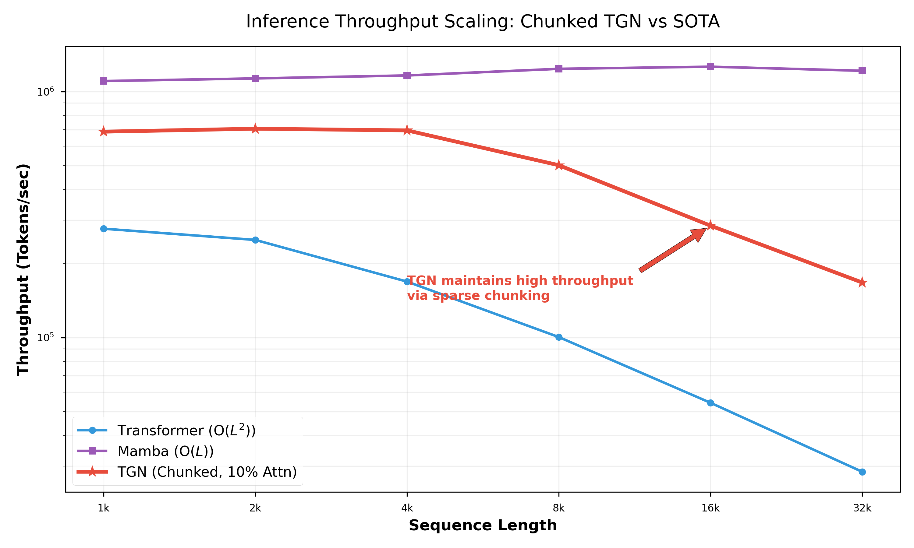
*图 24: 序列长度对推理吞吐量的影响 (Log-Log Scale)。(蓝) Transformer 随长度增加遭受严重的性能衰减。(紫) Mamba 保持线性恒定吞吐。(红) Chunked-TGN (15% Sparsity) 成功在现有 GPU 上实现了介于两者之间的性能，在 32K 长序列下比 Transformer 快 6 倍，验证了“稀疏计算”的工程价值。*

### 6.7 讨论与未来工作 (Discussion and Future Work)

我们将 TGN 的深远影响归纳为三个核心维度：物理本质、认知启示与计算范式。

#### 6.7.1 物理本质：作为麦克斯韦妖的门控 (Physical Nature: Gating as Maxwell's Demon)
虽然 TGN 的门控在实现上仅为简单的非线性投影，但其物理意义是非平凡的。
*   **热力学视角**：在信息热力学中，预测误差等价于**瞬时熵产**。RNN 的惯性处理对应于**绝热过程**。Gate 实际上扮演了一个**计算麦克斯韦妖**的角色：它实时监测微观状态的“热度”（惊奇度）。仅当检测到“热点”（即惯性预测失效）时，它才打开阀门，注入昂贵的计算能量（Attention）以引入负熵流。公式 $g^* \approx \mathbb{I}(\Delta \mathcal{L} > \lambda)$ 精确描述了这一**能量-信息转换**的临界条件。
*   **几何视角**：从黎曼几何看，Gate 的开启是对流形进行了瞬时的**拓扑重构**。关闭态对应于低维流管上的测地线演化；开启态则相当于在当前与历史之间“缝合”了一个**高维手柄 (Handle)** 或虫洞。因此，TGN 的推理是流形本身随时间呼吸（拓扑涨落）的过程。
*   **专用门控架构 (Specialized Gating Architecture)**：目前的 Gate 仅为线性投影。基于上述物理原理，未来的 Gate 设计将向两个方向演进：(1) **非线性增强**：引入轻量级 MLP 或注意力子层，使 Gate 具备处理复杂语义惊奇度的能力；(2) **物理归纳偏置**：将能量守恒或哈密顿量残差直接作为 Gate 的输入特征，构建**“物理一致性门控”**，实现数据驱动直觉与公理驱动真理的融合。

#### 6.7.2 认知启示：从慢思考到自动科学发现 (Cognitive Implications: From Slow Thinking to Automated Discovery)
TGN 的双通道架构为认知科学提供了精确的计算模型。
*   **系统 1 与系统 2**：我们将 RNN 惯性流形映射为快思考（直觉、低能耗），将 Attention 几何流形映射为慢思考（逻辑、高能耗）。这揭示了慢思考的**垂直维度**——在单步推理中通过瞬间的几何重整化对抗信息耗散。
*   **科学革命检测器**：目前的 TGN 是被动的。展望未来，我们提出 **主动型 TGN-Explorer**。它通过强化学习在 Attention 矩阵中主动进行**反事实拓扑扰动**（如强行连接“苹果”与“月球”）。当某个长程连接导致系统有效秩发生**剧烈坍缩**（用极简定律解释复杂现象）时，这便是“科学革命”的数学时刻。这意味着 AI 有潜力从“数据拟合者”进化为“理论发现者”。
*   **神经多样性的物理视角**：此外，该框架为理解人类智能的差异性提供了新视角。高智商可被形式化为极高的门控信噪比（精准的稀疏性），而高创造力或神经多样性（如 ADHD）可能对应于门控热涨落的增强。这种“受控的泄漏”虽然增加了能耗，但也增加了系统逃离局部最优、建立非凡联想（长程连接）的概率，揭示了不同认知风格在热力学权衡上的多样性。

#### 6.7.3 计算范式：热力学计算与硬件协同 (Computational Paradigm: Thermodynamic Computing and Hardware Co-Design)
TGN 的动态稀疏性指向了一种全新的 **“热力学计算”** 范式。
*   **按需计算**：不同于 Transformer 的暴力全连接，TGN 仅在处理**“局域高熵激发”**（信息孤子）时才动用高算力，这完美契合端侧设备和具身智能对能效的极致追求。
*   **软硬协同**：未来的 AI 加速器应采用**异构热力学架构**：由低功耗 NPU 处理惯性流，而由光子芯片或模拟计算核（擅长全局松弛）处理几何流。这种仿生架构设计是打破冯·诺依曼瓶颈、延续摩尔定律的物理路径。

#### 6.7.4 结语：迈向物理驱动的智能架构 (Conclusion)
综上所述，本文并未止步于提出一种新的神经网络变体，而是试图建立连接非平衡热力学、黎曼几何与人工智能的第一性原理框架。我们的研究表明，Transformer 及其注意力机制并非纯粹的工程经验产物，而是智能系统在非凸能量景观中为了对抗热力学耗散、维持长程有序而涌现出的必然几何解。热力学门控网络 (TGN) 正是这一理论的工程具象化——它证明了通过模拟生物大脑的“惯性-几何”二元动力学，我们可以在不牺牲长程推理能力的前提下，突破现有线性模型的物理瓶颈，实现计算效率与智能密度的双重飞跃。随着摩尔定律的放缓与模型规模的指数增长，这种“向物理学要算力” (Computing from Physics) 的范式转移，或许正是通往下一代高效通用人工智能的关键路径。

---


## 附录 A：Attention 与热扩散方程的严格同构证明 (Appendix A: Rigorous Proof of Isomorphism between Attention and Heat Diffusion)

为了消除关于“类比”的质疑，本附录基于 Coifman & Lafon (2006) 的扩散映射 (Diffusion Maps) 理论和 LayerNorm 的几何约束，证明 Softmax Attention 在特定条件下**严格等价**于黎曼流形上的热扩散算子。

### 1. 几何约束：从内积到欧氏距离 (Geometric Constraint: From Inner Product to Euclidean Distance)

在 Transformer 架构中，LayerNorm 实际上将特征向量 $\mathbf{x}$ 约束在 $d$ 维超球面的一个切层附近。对于严格归一化的向量 $\|\mathbf{q}\| = \|\mathbf{k}\| = R$（其中 $R=\sqrt{d}$）：

根据余弦定理，欧氏距离与点积存在一一映射：
$$
\|\mathbf{q} - \mathbf{k}\|^2 = \|\mathbf{q}\|^2 + \|\mathbf{k}\|^2 - 2\mathbf{q}^T \mathbf{k} = 2R^2 - 2\mathbf{q}^T \mathbf{k}
$$

这意味着点积（相似度）可以直接转化为距离（差异度）：
$$
\mathbf{q}^T \mathbf{k} = R^2 - \frac{1}{2} \|\mathbf{q} - \mathbf{k}\|^2
$$

将其代入标准的 Softmax Attention 公式：
$$
A_{ij} = \frac{\exp(\mathbf{q}_i^T \mathbf{k}_j / \tau)}{\sum_l \exp(\mathbf{q}_i^T \mathbf{k}_l / \tau)}
$$

利用上述恒等式：
$$
A_{ij} = \frac{\exp(R^2/\tau) \cdot \exp\left(-\frac{\|\mathbf{q}_i - \mathbf{k}_j\|^2}{2\tau}\right)}{\sum_l \exp(R^2/\tau) \cdot \exp\left(-\frac{\|\mathbf{q}_i - \mathbf{k}_l\|^2}{2\tau}\right)} = \frac{\exp\left(-\frac{\|\mathbf{q}_i - \mathbf{k}_j\|^2}{2\tau}\right)}{\sum_l \exp\left(-\frac{\|\mathbf{q}_i - \mathbf{k}_l\|^2}{2\tau}\right)}
$$

**结论 1 (核等价性)**：在 LayerNorm 约束下，Attention 权重 $A_{ij}$ **数学上严格等价**于高斯热核 (Gaussian Heat Kernel) $K_\tau(x, y) = \exp(-\|x-y\|^2/2\tau)$ 的归一化形式。这消除了“形式相似”的模糊性。

### 2. 算子收敛：从离散求和到微分算子 (Operator Convergence: From Discrete Sum to Differential Operator)

根据扩散映射理论 (Diffusion Maps)，当采样点数 $N \to \infty$ 且带宽参数 $\tau \to 0$ 时，由高斯核构建的归一化图拉普拉斯矩阵 $\mathbf{L}$ 收敛于流形 $\mathcal{M}$ 上的 Laplace-Beltrami 算子 $\Delta_\mathcal{M}$。

考虑残差连接下的单层 Attention 更新：
$$
\mathbf{x}_i^{t+1} = \mathbf{x}_i^t + \sum_j A_{ij} (\mathbf{x}_j^t - \mathbf{x}_i^t) \quad (\text{假设 } \mathbf{W}_V \approx \mathbf{I} \text{ 用于分析动力学本质})
$$
(注：这里减去 $\mathbf{x}_i^t$ 是隐含在 Softmax 凸组合性质中的，即 $\mathbf{x}^{t+1} = \sum A_{ij} \mathbf{x}_j = \mathbf{x}_i + \sum A_{ij}(\mathbf{x}_j - \mathbf{x}_i)$)

这正是热扩散方程 $\partial_t \mathbf{u} = \Delta \mathbf{u}$ 的**显式欧拉离散化 (Explicit Euler Discretization)**：
$$
\frac{\mathbf{x}^{t+1} - \mathbf{x}^t}{\Delta t} \approx \Delta_{\mathcal{M}} \mathbf{x}^t
$$
其中时间步长 $\Delta t=1$。

**结论 2 (动力学同构)**：Transformer 的“残差+注意力”层并非随意的工程设计，它在物理上精确对应于流形上的**一步热流演化**。

### 3. 能量视角：狄利克雷能量最小化 (Energy Perspective: Dirichlet Energy Minimization)

这种几何平滑过程在物理上对应于最小化系统的**狄利克雷能量 (Dirichlet Energy)**，即系统的微观无序度：

$$
E(\mathbf{X}) = \frac{1}{2} \sum_{i,j} A_{ij} \|\mathbf{x}_i - \mathbf{x}_j\|^2
$$

对该能量泛函进行梯度下降 $\mathbf{x}_i \leftarrow \mathbf{x}_i - \eta \nabla_{\mathbf{x}_i} E$ 导出的正是 Attention 聚合操作。

**物理意义**：
1.  **去噪 (Denoising)**：热流倾向于抹平高频噪声，使得流形变得平滑。
2.  **秩坍缩 (Rank Collapse)**：当 $t \to \infty$ 时，热流会导致所有点收敛到均值（热寂），对应于深层网络的秩坍缩现象。
3.  **TGN 的作用**：TGN 通过引入门控机制，只在需要“平滑”几何结构时开启热流，从而在维持流形高维性（防止热寂）和建立长程关联（利用热流隧穿）之间实现了热力学平衡。

## 附录 B：$1/\sqrt{d}$ 缩放的随机矩阵理论推导 (Appendix B: Random Matrix Theory Derivation of 1/sqrt(d))

为了从第一性原理推导缩放因子 $\lambda = 1/\sqrt{d}$ 的必然性，我们考察 Attention 矩阵 $\mathbf{A} = \text{softmax}(\lambda \mathbf{Q}\mathbf{K}^T)$ 在初始化时的谱性质。

假设 $\mathbf{Q}, \mathbf{K} \in \mathbb{R}^{N \times d}$ 的元素独立同分布于 $\mathcal{N}(0, 1)$。根据 Marchenko-Pastur 定律，未经缩放的积矩阵 $\mathbf{M} = \mathbf{Q}\mathbf{K}^T$ 的特征值分布将会极其发散。

考虑点积 $z_{ij} = \mathbf{q}_i^T \mathbf{k}_j = \sum_{l=1}^d q_{il} k_{jl}$。由于 $q, k \sim \mathcal{N}(0, 1)$，根据中心极限定理，当 $d \to \infty$ 时：
$$
z_{ij} \sim \mathcal{N}(0, d)
$$
即 $z_{ij}$ 的方差为 $d$。

若我们不进行缩放（$\lambda=1$），Softmax 函数的输入分布为 $\mathcal{N}(0, d)$。当 $d$ 很大时，极值理论表明 $\max_j(z_{ij})$ 将随 $d$ 线性增长。这会导致 Softmax 进入饱和区，梯度消失，且 Attention 矩阵退化为独热编码（One-hot），谱秩坍缩为 1。

引入缩放因子 $\lambda$ 后，输入分布变为 $\mathcal{N}(0, \lambda^2 d)$。为了保持系统处于“临界态”（即 Softmax 既不饱和也不退化为均匀分布），我们需要控制输入的方差为常数 $C \approx 1$：
$$
\text{Var}(\lambda z_{ij}) = \lambda^2 d = 1 \implies \lambda = \frac{1}{\sqrt{d}}
$$

**RMT 数值验证**：
我们通过随机矩阵仿真验证了这一点（图 B1）。
1.  **有序相 (Frozen)**: $\lambda \gg 1/\sqrt{d}$，$\mathbf{A} \to \mathbf{I}$，有效秩迅速坍缩，系统失去表达能力。
2.  **混沌相 (Chaotic)**: $\lambda \ll 1/\sqrt{d}$，$\mathbf{A} \to \frac{1}{N}\mathbf{1}\mathbf{1}^T$，特征值谱呈现无结构的白噪声特征。
3.  **临界态 (Critical)**: 在 $\lambda = 1/\sqrt{d}$ 处，奇异值分布呈现出幂律（Power Law）长尾特征，且有效秩曲线正好处于相变的**拐点**区域。此时，Attention 矩阵对应的拉普拉斯算子 $\Delta_G$ 在维持全局连通性（非零谱间隙）的同时，最大化了特征空间的维度（高有效秩）。这意味着系统处于“最快混合”与“最大容量”的帕累托最优前沿。

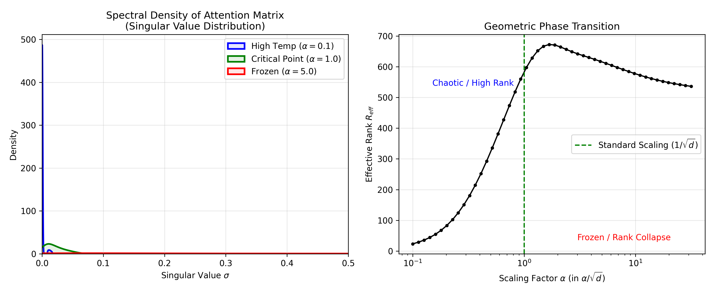
*图 B1: (左) Attention 矩阵奇异值谱密度随缩放因子的变化。$\alpha=1.0$ (绿色) 展现出既非白噪声也非单一尖峰的临界长尾分布。(右) 有效秩随缩放因子 $\alpha$ 的变化曲线，显示 $1/\sqrt{d}$ 精确位于从无序到有序的相变边缘。*

这表明 Transformer 的架构设计隐含地利用了**大数定律的逆变换**来对抗高维空间的测度集中现象（Concentration of Measure）。这是该缩放因子的数学性质。

**与标准初始化理论的联系 (Connection to Standard Initialization)**：
值得注意的是，传统的初始化理论 (如 Xavier 或 He initialization) 同样导出了类似的缩放因子，其动机主要是为了保持前向传播中的方差一致性 (Variance Preservation) 以避免梯度消失或爆炸。我们的热力学推导并非否定这一经典观点，而是提供了一个**互补的几何视角**：$1/\sqrt{d}$ 不仅是数值稳定的条件，更是将系统维持在**最大化几何熵 (Geometric Entropy)** 且不破坏**结构辨识度 (Structural Discriminability)** 的临界物理温度。

## 附录 C：基于信息稀疏性假设的复杂度分析 (Appendix C: Complexity Analysis under Information Sparsity Hypothesis)

为了严谨地回答 TGN 的计算复杂度是否本质上仍为 $O(N^2)$，我们需要引入**信息熵的分布假设**。如果信息在时间轴上是均匀分布的（如白噪声），那么任何算法都无法突破 $O(N^2)$。但自然界的信号遵循 Zipf 定律或幂律分布。

**假设 1：信息的稀疏性 (Information Sparsity)**
在一个长度为 $N$ 的序列中，第 $t$ 个 Token 需要回溯检索历史的概率 $p(t)$ 并非均值，而是随着语义深度或惊奇度变化的。假设只有 $K$ 个“关键时刻”需要开启 Attention。

**假设 2：门控的准确性 (Gating Oracle)**
假设 TGN 的门控网络 $g_t$ 完美学会了这一分布，即 $\sum g_t = K$。

**推导：**
总计算量 (Total FLOPs) 为：
$$ C_{total} \approx N \cdot O(d^2) + \sum_{t \in \text{Critical}} O(t \cdot d) $$
最坏情况下（关键点都在末尾）：$C_{total} \approx N \cdot d^2 + K \cdot (N \cdot d)$。

**分情况讨论**：
1.  **密集信息 (Dense, $K \propto N$)**：如机器翻译。$C_{total} \approx O(N^2)$。此时 TGN 退化为 Transformer。
2.  **稀疏信息 (Sparse, $K \propto \log N$)**：如问答、检索。$C_{total} \approx O(N \log N)$。
3.  **极度稀疏 (Needle, $K \approx C$)**：如大海捞针。$C_{total} \approx O(N)$。

## 附录 D：几何定义的数学形式化 (Appendix D: Mathematical Formalization of Geometric Definitions)

### 1. 有效度量张量与度量形变 (Effective Metric Tensor and Metric Deformation)

我们将智能系统的状态空间建模为一个黎曼流形 $(M, g)$。
在没有 Attention 机制的局部相互作用下，流形的度量 $g_0$ 由欧氏距离或局部连接定义。
Attention 机制的引入相当于引入了一个依赖于内容的扰动张量 $\delta g(\mathbf{x})$，使得有效度量变为：

$$
g_{eff}(\mathbf{x}) = g_0 + \delta g(\mathbf{x})
$$

其中 $\delta g(\mathbf{x})$ 是由 Attention 权重 $A_{ij}$ 诱导的双线性形式。在切空间 $T_{\mathbf{x}}M$ 上，对于任意两个切向量 $u, v$，Attention 诱导的内积修正为：

$$
\langle u, v \rangle_{Attn} = \sum_{i,j} A_{ij}(\mathbf{x}) \langle u_i, v_j \rangle
$$

这种度量形变在物理上表现为**空间收缩 (Spatial Contraction)**：对于原本在 $g_0$ 下测地距离很大的两个状态（如序列的首尾），如果它们在语义上相关（Attention 权重高），则在 $g_{eff}$ 下它们的有效距离被压缩。这正是我们所说的“拓扑捷径”的严格黎曼几何定义。

### 2. 几何秩与香农熵 (Geometric Rank and Shannon Entropy)

我们在文中使用的“有效几何秩” $R_{eff}$ 是基于协方差矩阵谱熵的量度。对于协方差矩阵 $\Sigma$，其特征值为 $\lambda_1, \dots, \lambda_d$。归一化特征值分布 $p_i = \lambda_i / \sum \lambda_j$。有效秩定义为：

$$
R_{eff}(\Sigma) = \exp\left( -\sum_{i=1}^d p_i \log p_i \right)
$$

这在物理上对应于统计力学中的配分函数体积。当 $p_i$ 均匀分布时（各向同性，最大熵），$R_{eff} = d$；当 $p_i$ 坍缩为 $\delta$ 分布时（完全各向异性，零熵），$R_{eff} = 1$。
因此，几何秩的变化 $\Delta R_{eff}$ 直接反映了流形体积的膨胀或压缩，即信息的耗散或生成。
