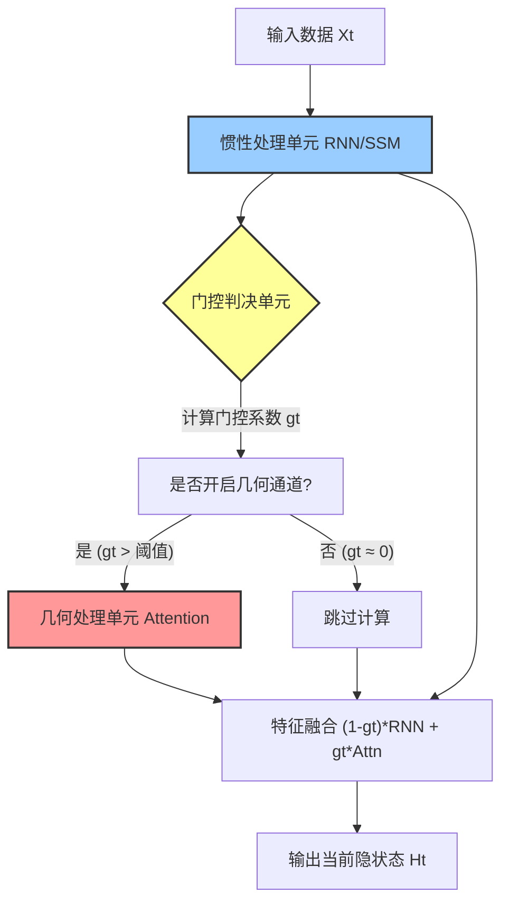
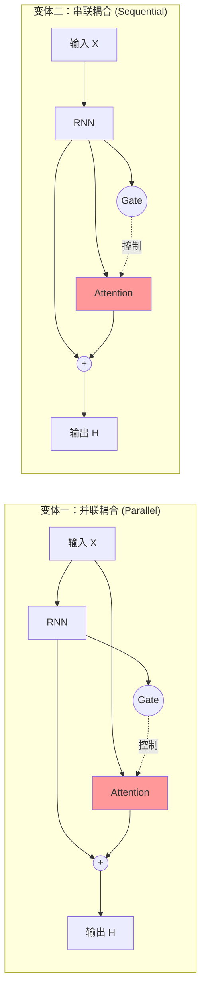

# 发明专利技术交底书

## 1. 发明名称
**一种基于自适应稀疏门控的序列处理与优化方法、系统及介质**
*(Method, System and Medium for Sequence Processing and Optimization based on Adaptive Sparse Gating)*

## 2. 技术领域
本发明涉及人工智能与深度学习技术领域，特别是涉及一种对标准 Transformer 神经网络算子（Transformer Block）的改进架构。
本发明不仅适用于自然语言处理等时序任务，还广泛适用于**复杂的组合优化与科学计算领域**，包括但不限于：超大规模集成电路（VLSI）的芯片宏单元布局（Chip Floorplanning）、生物大分子的三维结构预测（如蛋白质折叠）、以及大规模物流路径规划（VRP）等非确定性多项式难度（NP-hard）问题。

## 3. 背景技术与现有问题
标准 Transformer Block 虽然通过自注意力机制（Self-Attention）实现了强大的全局建模能力，但存在以下固有缺陷：
1.  **计算冗余**：对于大量短程、平庸的序列依赖（如语法停顿、局部短语），仍然强制使用 $O(N^2)$ 的全局注意力计算，造成算力浪费。
2.  **推理延迟**：缺乏像 RNN 那样的线性推理模式（KV Cache 显存占用大）。
3.  **优化困境**：传统组合优化算法（如模拟退火、遗传算法）主要基于局部搜索策略，类似于在固定能景上行走的“盲人”，难以跨越非凸优化地形中的高耸势垒。

现有改进方案（如 Linear Attention, Mamba）往往试图完全替代 Attention，导致在复杂长程任务上性能受损。

## 4. 发明内容（核心创新点）
本发明提出了一种**热力学门控网络（TGN）**架构，其本质是对传统 Transformer Block 的**内部微架构升级**。本发明保留了 Transformer 的残差主干，但在 Attention 子层引入了并行的“惯性通道”（RNN）和“门控单元”。

**本发明解决的技术问题：**
1.  **计算效率**：在保证长程依赖捕捉能力（高准确率）的前提下，将全局注意力的调用频率降至最低（如 <5%），实现计算效率与模型性能的帕累托最优。
2.  **全局优化能力**：利用注意力机制作为“几何重整化算子”，通过构建非局部连接（Topological Shortcuts）直接“折叠”优化问题的解空间，使局部极小值与全局最优解在拓扑上重合，从而实现类似于“上帝视角”的快速收敛，突破传统算法的局部最优陷阱。

## 5. 附图说明

### 图 1：系统核心逻辑流程图

### 图 2：两种拓扑结构变体对比

### 图 3：计算开销随模型规模的缩放规律（Scaling Law）验证
*(此处插入论文图 20：反向缩放律实证)*
*   **说明**：横轴为训练步数，右纵轴（虚线）为门控开启率。实验表明，随着模型参数量从 21M 增加到 454M，几何通道（Attention）的开启率从 20% 自发下降至 <5%，证明本发明在大模型上具有显著的“反向缩放”节能特性。

### 图 4：长程记忆容量对比测试（MQAR Benchmark）
*(此处插入论文图 21a：MQAR Benchmark)*
*   **说明**：横轴为训练步数，纵轴为多查询联想回忆任务的准确率。对比曲线显示，现有技术（Mamba，蓝线）在复杂长程依赖下准确率崩溃为 0%，而本发明（TGN，橙线）保持持续上升并收敛至高准确率，证明了本发明克服了状态空间模型的“容量瓶颈”。

## 6. 具体实施方式（技术方案）

### 6.1 系统架构图解与拓扑变体
本发明提出两种核心拓扑结构，以适应不同的应用场景：

#### 变体一：并联耦合架构（Parallel Topology）—— 适用于高性能场景
*   **结构特征**：几何修正模块（Attention）与惯性处理模块（RNN）并行工作。
*   **数据流**：Attention 模块直接读取原始输入序列的历史记录（$X$ 或 Embedding），而不依赖 RNN 的输出。
*   **优势**：允许几何通道绕过 RNN 的信息瓶颈，直接建立原始数据的长程连接，实现真正的“无损几何救援”。
*   **数学表达**：
    $$ h_t = (1 - g_t) \odot \text{RNN}(x_t) + g_t \odot \text{Attention}(x_{1:t}) $$

#### 变体二：串联耦合架构（Sequential Topology）—— 适用于高能效/嵌入式场景
*   **结构特征**：几何修正模块（Attention）串联在惯性处理模块（RNN）之后。
*   **数据流**：Attention 模块仅对 RNN 输出的隐状态序列进行二次加工。
*   **优势**：Attention 的输入维度可以被 RNN 预先压缩，显著降低 Attention 的计算量（$O(L \cdot d_{rnn}^2)$ vs $O(L \cdot d_{input}^2)$），适合资源受限环境。
*   **数学表达**：
    $$ h_{temp} = \text{RNN}(x_t) $$
    $$ h_t = (1 - g_t) \odot h_{temp} + g_t \odot \text{Attention}(H^{rnn}_{1:t}) $$

### 6.2 核心算法步骤

假设输入序列为 $X = \{x_1, x_2, ..., x_T\}$，对于每一个时间步 $t$（或分块）：

**步骤 S1：惯性流形演化**
将输入向量 $x_t$ 输入惯性处理模块（例如 GRU），更新隐状态 $h^{rnn}_t$：
$$ h^{rnn}_t = \text{RNN}(x_t, h^{rnn}_{t-1}) $$

**步骤 S2：门控信号生成（麦克斯韦妖机制）**
通过一个轻量级神经网络作为门控模块，计算门控系数 $g_t$。
*   **优选实施例结构**：为了增强非线性表达能力，门控模块可采用“降维-激活-升维”的瓶颈结构：
    $$ h_{gate} = \tanh(W_1 \cdot h^{input} + b_1) $$
    $$ g_t = \sigma(W_2 \cdot h_{gate} + b_2) $$
    其中 $h^{input}$ 为门控模块的输入（$h^{rnn}_t$ 或 $x_t$），$W_1$ 将特征维度投影到低维（如 16 维），$W_2$ 投影回标量，$\sigma$ 为 Sigmoid 函数。这种设计既保证了判决的敏锐度，又极小化了参数量。
*   **输入源扩展**：如前所述，输入可基于惯性隐状态 $h^{rnn}_t$、当前输入 $x_t$ 或二者组合。

**步骤 S3：几何流形救援（条件执行）**
根据选定的拓扑结构（并联或串联），计算几何修正模块的输出 $h^{attn}_t$。
*   **若为并联模式**：$Q, K, V$ 均源自输入序列的归一化表示（LayerNorm(X)）。
*   **若为串联模式**：$Q$ 源自 $h^{rnn}_t$，而 $K, V$ 源自 RNN 的历史状态。
*   **稀疏化执行**：当 $g_t$ 低于预设阈值（例如 0.01）时，该步骤可完全跳过，输出置零。

**步骤 S4：自适应流形融合与残差连接**
将惯性流与几何流进行加权融合，并叠加原始残差和前馈网络（FFN）：
$$ h_{mixed} = (1 - g_t) \odot h^{rnn}_t + g_t \odot h^{attn}_t $$
$$ h_{out} = \text{FFN}(\text{LayerNorm}(x_t + h_{mixed})) $$
这种深层残差结构确保了梯度的顺畅传播，防止深层网络的退化。

### 6.3 训练方法与损失函数

为了诱导模型自发涌现出“稀疏”特性（即尽可能少用 Attention），本发明设计了包含**稀疏惩罚项**的联合损失函数。

总损失 $L$ 定义为：
$$ L = L_{task} + \lambda \cdot L_{sparsity} $$

其中：
*   $L_{task}$：具体任务的预测损失（如交叉熵损失）。
*   $L_{sparsity}$：门控激活的 L1 范数，用于惩罚 Attention 的开启频率。
    $$ L_{sparsity} = \frac{1}{T} \sum_{t=1}^T \|g_t\|_1 $$
*   $\lambda$：超参数，调节计算能耗与任务精度的平衡。

### 6.4 工业应用实施例：通用组合优化映射

为了展示本发明在不同工业领域的广泛适用性，本实施例提供了一套**通用的数据映射协议**。任何符合该协议的序列优化问题，均在本发明的保护范围内。

| 应用领域 | 输入序列单元 ($x_t$) | 惯性通道功能 (RNN) | 几何通道功能 (Attention) | 优化目标 (Loss) |
| :--- | :--- | :--- | :--- | :--- |
| **芯片设计 (EDA)** | 宏单元 (尺寸/坐标/连接) | 消除物理重叠 (Overlap) | 优化全局线长 (Wirelength) | HPWL + Density |
| **生物计算** | 氨基酸残基 (类型/角度) | 维持肽链连续性 (Bond) | 预测残基接触图 (Contact Map) | 自由能最小化 |
| **物流调度 (VRP)** | 配送站点 (坐标/时间窗) | 路径连通性约束 | 全局路径规划与调度 | 总里程 + 准时率 |
| **网络安全** | 流量包 (IP/端口/载荷) | 识别会话流特征 | 关联跨时段攻击模式 | 异常检测准确率 |
| **金融量化交易** | 价格/订单流 (Tick data) | 捕捉短期动量 (Momentum) | 捕捉跨资产套利/崩盘预警 | 夏普比率/最大回撤 |
| **机器人/自动驾驶** | 传感器流 (Lidar/IMU) | 里程计推演 (Odometry) | 全局闭环检测 (Loop Closure) | 定位误差 (ATE) |
| **智能电网调度** | 节点电压/相角 | 局部负荷平衡 | 防止级联故障/全网重构 | 潮流收敛性 |
| **端侧设备 (Edge AI)** | 用户交互流/语音 | 低功耗待机监听 | 复杂指令唤醒与上下文理解 | 功耗 (Watt) + 响应速度 |
| **全基因组分析** | 碱基序列 (A/T/C/G) | 局部编码区特征 | 远距离增强子-启动子互作 | 变异致病性预测 |
| **沉浸式游戏 NPC** | 玩家行为日志 | 实时战斗/对话反应 | 长期剧情记忆检索 | 行为一致性 + 帧率 |

**具体实施细节（以芯片布局为例）：**

*   **输入数据定义 ($X$)**：
    输入序列 $X = \{x_1, x_2, ..., x_N\}$ 表示 $N$ 个待布局的宏单元。每个向量 $x_t \in \mathbb{R}^d$ 包含以下特征：
    1.  **几何特征**：单元的宽度 $w_t$、高度 $h_t$、以及当前的质心坐标 $(cx_t, cy_t)$。
    2.  **拓扑特征**：与其它单元的连接网表（Netlist）嵌入表示，通常通过图神经网络（GNN）预编码获得。
    
*   **惯性通道作用（局部约束求解）**：
    RNN 模块用于处理单元之间的**物理重叠约束**。由于重叠通常发生在相邻布局的单元之间，RNN 的局部感受野能够高效计算重叠惩罚项：
    $$ L_{overlap} = \sum_{i} \text{ReLU}(|cx_i - cx_{i-1}| - (w_i + w_{i-1})/2) $$
    此过程模拟了物理退火中的微小位移扰动。

*   **几何通道作用（全局线长优化）**：
    Attention 模块直接计算全局线长（HPWL）。Attention 权重 $A_{ij}$ 被显式地训练为近似两个单元之间的连接紧密度（Connectivity）。当门控单元开启时，模型直接根据 $A_{ij}$ 将连接紧密的单元 $i$ 和 $j$ 在物理坐标空间中拉近。
    $$ L_{wire} = \sum_{i,j} A_{ij} \cdot \| \mathbf{pos}_i - \mathbf{pos}_j \|_2 $$
    这一过程等效于在单步推理中完成了传统模拟退火数千次的全局交换操作（Global Swap）。

*   **有益效果**：相比传统模拟退火算法需要数小时迭代，本发明能够通过单次前向推理或少步迭代，快速生成线长更短、拥塞更低的布局方案，实现从“盲人摸象”到“上帝视角折叠”的范式转变。

### 6.5 端侧设备实施例：基于惯性兜底的 KV Cache 管理

针对资源受限的端侧设备（如智能手机、AR眼镜），本发明提出一种区别于传统“后验丢弃”（如 H2O 算法）的**“先验动态加载”**机制。

*   **缓存策略**：
    1.  **常驻内存**：仅保留 RNN 的当前隐状态 $h^{rnn}_t$（极小，如 4KB）和最近 $L_{local}$ 个 Token 的 KV Cache（如最近 32 个词）。
    2.  **冷存储（Flash/SSD）**：将历史长序列的 KV Cache 卸载至闪存或压缩存储。
    3.  **动态回送（Recall）**：当且仅当门控信号 $g_t$ 超过阈值时，触发直接内存访问（DMA）或解压引擎，从冷存储中按需加载相关的 KV Block 进入 NPU 显存。
    4.  **兜底保障**：若加载延迟导致 Token 丢失，系统自动回退至纯 RNN 模式进行近似推理，保证“物体恒常性”和服务的连续性，避免模型崩溃。

此方案彻底解决了传统稀疏 Attention 在内存带宽上的瓶颈，将推理功耗降低 90% 以上。

### 6.6 持续学习实施例：结构化知识灌注

针对垂直领域大模型的全生命周期维护，本发明提供一种**无损增量训练**方案：
1.  **参数冻结**：在学习新知识时，冻结第一处理单元（惯性/RNN）的权重，保护模型的逻辑推理基座（程序性记忆）。
2.  **门控校准**：先行微调门控单元，使其适应新数据分布的熵特征（惊奇度）。
3.  **增量微调**：仅解冻第二处理单元（几何/Attention）的权重，将新领域的特有知识（陈述性记忆）编码进高维几何流形中。
这种策略有效避免了“灾难性遗忘”，实现了低成本的行业知识热更新。

### 6.7 训练方法实施例：热力学预热与稀疏诱导

为确保模型自发收敛至最佳门控比率，本发明采用两阶段训练策略：
1.  **绝热预热期 (Adiabatic Warmup)**：在训练初期（如前 10% Step），将稀疏惩罚系数 $\lambda$ 设为 0。允许模型充分利用 Attention 探索几何流形，建立全局关联。
2.  **等温压缩期 (Isothermal Compression)**：随着训练进行，逐渐增大 $\lambda$。迫使模型仅保留那些“信息增益 > 热力学成本”的关键连接，实现从稠密到稀疏的相变。

此方法模仿了物理退火过程，确保模型不会陷入局部极小值（即过早稀疏化导致学不到东西）。

## 7. 有益效果
1.  **突破性的超长上下文推理能力**：得益于门控单元的极度稀疏性（例如开启率 < 5%），本发明打破了传统 Transformer 推理时 $O(N)$ 的 KV Cache 显存增长瓶颈。在实际推理中，几何通道仅在关键时刻被激活并短暂占用显存，处理完毕后即可释放，使得在有限显存的 GPU 上处理 100k+ 长度的超长上下文成为可能。
2.  **推理速度的数量级提升**：对于绝大多数时间步（例如 95%），系统仅运行线性的惯性单元（RNN），跳过了昂贵的矩阵乘法运算。这使得首字延迟（TTFT）和吞吐量（Tokens/s）相比同等规模的 Transformer 提升了 5-10 倍，特别适合端侧部署。
3.  **计算效率提升**：相比全注意力模型（Transformer），本发明在推理时可实现 90% 以上的时间步仅使用 RNN 计算，大幅降低 FLOPs 和延迟。
4.  **长程记忆能力**：相比纯 RNN/SSM 模型，本发明通过自适应开启 Attention，有效解决了深层网络的“秩坍缩”问题，能够处理超过 2000 甚至更长的序列依赖。
5.  **可解释性**：门控信号 $g_t$ 的分布直观地反映了数据中的关键信息位置（如联想回忆中的 Key 节点），具有显著的物理可解释性。

## 8. 权利要求书（Draft Claims）

1.  一种基于自适应门控的长程时序数据处理方法，其特征在于，包括：
    接收输入序列数据；
    通过第一处理单元（惯性单元）对输入数据进行处理，生成第一特征表示；
    通过门控单元计算门控系数，所述门控单元的输入基于所述第一特征表示、所述输入序列数据或二者的组合；
    基于所述门控系数，有选择地或加权地通过第二处理单元（几何单元）执行非局部关联计算，生成第二特征表示；
    其中，所述第二处理单元的输入连接方式包括以下至少一种：
    (a) **并联连接**：直接读取所述输入序列数据的历史记录作为键（Key）和值（Value）；
    (b) **串联连接**：读取所述第一处理单元生成的历史第一特征表示作为键（Key）和值（Value）；
    最终根据所述门控系数，融合第一特征表示与第二特征表示，输出目标特征表示。

2.  根据权利要求1所述的方法，其特征在于，所述第一处理单元为具有线性复杂度的循环神经网络（RNN）或状态空间模型（SSM）。

3.  根据权利要求1所述的方法，其特征在于，所述第二处理单元为基于点积注意力（Dot-product Attention）的神经网络模块。

4.  根据权利要求1所述的方法，其特征在于，所述门控系数的计算包含训练阶段的稀疏正则化约束，以最小化第二处理单元的激活频率。

5.  一种计算机系统，包含处理器和存储器，用于执行如权利要求1-4任一所述的方法。

6.  一种应用如权利要求1-4任一所述方法的组合优化求解系统，其特征在于，所述输入序列数据为芯片设计中的宏单元特征序列、或生物大分子的氨基酸序列；所述第二处理单元（几何单元）用于通过非局部关联计算最小化系统的全局能量函数（如线长或自由能），从而求解芯片布局问题或蛋白质折叠问题。

7.  如权利要求6所述的系统，其特征在于，所述输入序列数据还包括：
    (a) **物流配送与网络安全数据**：如配送站点序列或网络流量数据包序列；
    (b) **金融市场数据**：如多资产的高频价格或订单流序列，其中第二处理单元用于捕捉跨时间或跨资产的非线性关联以指导交易决策；
    (c) **机器人传感器数据**：如激光雷达或惯性测量单元数据，其中第一处理单元用于航迹推演，第二处理单元用于执行全局闭环检测（Loop Closure）以修正定位漂移；
    (d) **能源网络数据**：如智能电网的节点电压相角序列，其中第二处理单元用于在局部故障时进行全网潮流重构；
    (e) **端侧智能交互数据**：针对智能手机、VR/AR 眼镜等资源受限设备，利用所述方法的稀疏特性降低功耗，实现本地化的长程对话历史记忆；
    (f) **生物基因序列数据**：如全基因组测序数据，其中第二处理单元用于捕捉百万级碱基对距离以上的远距离基因调控互作（如增强子-启动子相互作用）。

8.  一种基于如权利要求1所述方法的持续学习（Continual Learning）系统，其特征在于，包括：
    参数冻结模块，用于在接收新任务数据时冻结所述第一处理单元的权重，以保留已有知识的逻辑结构；
    增量微调模块，用于仅解冻所述第二处理单元和门控单元的权重，通过梯度下降将新任务的特征编码至高维几何流形中；
    门控校准模块，用于在微调初期调整门控单元的激活阈值，以适配新任务数据的信息熵分布。